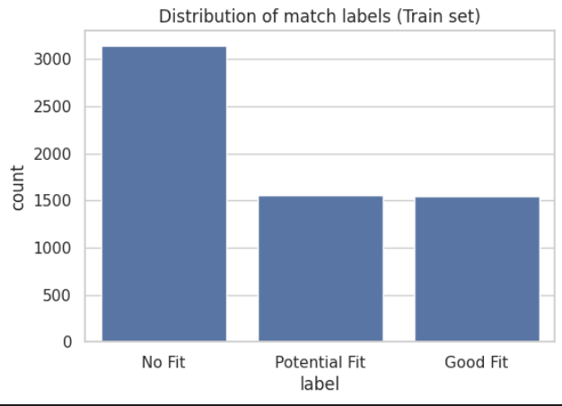
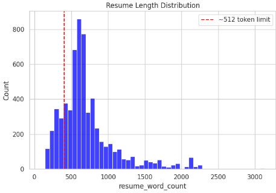
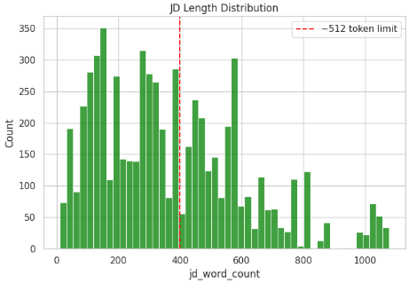
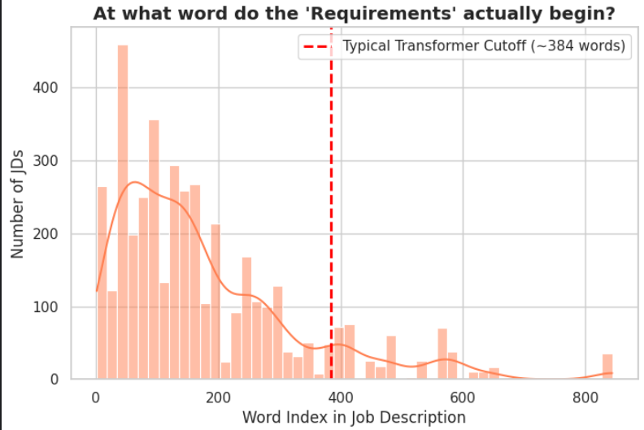
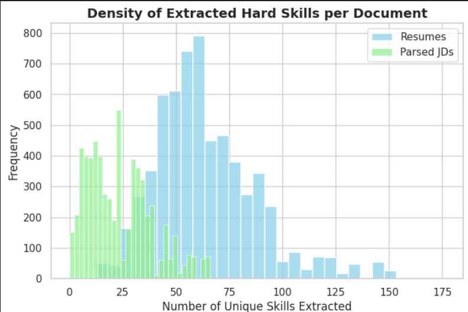

# Notebook 1: Data Preparation for Resume-JD Fit Prediction

## Project Overview

This notebook is the **first stage** of a multi-notebook NLP pipeline that predicts how well a resume matches a job description. The goal is to build a hybrid model combining Transformer-based text understanding with Graph Neural Networks (GNNs) that understand skill relationships - but before any model can be trained, the data must be carefully understood, cleaned, and engineered.

---

## Datasets Used

### Primary Dataset: `cnamuangtoun/resume-job-description-fit`
- **Train split:** 6,241 samples
- **Test split:** 1,759 samples
- **Features:** `resume_text`, `job_description_text`, `label`
- **Labels:** `No Fit`, `Potential Fit`, `Good Fit`

### Backup Dataset: `AzharAli05/Resume-Screening-Dataset`
- **Size:** 10,174 samples (train only)
- **Features:** `Role`, `Resume`, `Decision`, `Reason_for_decision`, `Job_Description`
- **Labels:** Binary (`select` / `reject`)

The **primary dataset** is used for model training and evaluation because it has a richer, three-class label scheme that captures nuance (a "potential fit" is meaningfully different from both a "good fit" and "no fit"). The backup dataset serves as a potential augmentation source if needed.

---

## Label Distribution Analysis

### Why This Matters
Before any modelling decision, understanding class balance is critical. An imbalanced dataset causes a classifier to be biased toward the majority class, giving misleadingly high accuracy while failing on minority classes.

### What We Found

| Label | Count | % of Train Set |
|---|---|---|
| No Fit | 3,143 | ~50.4% |
| Potential Fit | 1,556 | ~24.9% |
| Good Fit | 1,542 | ~24.7% |

The dataset is **moderately imbalanced** — "No Fit" is roughly twice as common as either positive class. This means:
- A naive classifier that always predicts "No Fit" would get ~50% accuracy.
- The model needs to be evaluated on **macro-averaged F1** or **AUC**, not just accuracy.
- Class weighting or oversampling may be needed in later training stages.

### Numeric Label Mapping
Labels are mapped to scores for potential regression-style training:

| Label | Score |
|---|---|
| No Fit | 0.0 |
| Potential Fit | 0.5 |
| Good Fit | 1.0 |

---

## Word Count Analysis

### Why This Matters — The Transformer Token Limit Problem

Transformer models like BERT and RoBERTa have a hard limit of **512 tokens** (approximately 350–400 words). Any text beyond this limit is simply **truncated** — the model never sees it.

This is a well-known but often-ignored problem. For **resumes**, which tend to be structured documents, early truncation usually cuts off the most recent and relevant experience. For **job descriptions**, the problem is even more severe, as we discovered.

### Resume Length Stats (Train Set)

| Statistic | Words |
|---|---|
| Mean | 708 |
| Median (50th) | 618 |
| 75th percentile | 810 |
| 90th percentile | 1,153 |
| 95th percentile | 1,591 |
| Max | 3,134 |

### Job Description Length Stats (Train Set)

| Statistic | Words |
|---|---|
| Mean | 371 |
| Median (50th) | 328 |
| 75th percentile | 532 |
| 90th percentile | 695 |
| 95th percentile | 810 |
| Max | 1,079 |

**Key Observation:** While the median JD is ~328 words (within the Transformer limit), a significant portion of JDs exceed 400 words. And as we show next, the *critical* content of those JDs often appears *after* the cutoff.

---

## The Hidden Requirements Problem (Key Data Insight)

### Hypothesis
Job descriptions typically open with company branding, culture statements, and role overviews — all of which are relatively uninformative for matching. The actual **technical requirements and qualifications** often appear much later in the document.

If the Transformer truncates a JD at word 384, and the Requirements section starts at word 450, the model will read only marketing text and miss everything that matters.

### Analysis

We wrote a function to locate keywords like `"requirements"`, `"qualifications"`, and `"what you need"` within each JD and measured at which word position they appeared.

### Result

**462 job descriptions in the training set had their requirements section appearing *after* the typical Transformer cutoff (~384 words).**

This is not a small edge case — it affects 7.4% of the training data, and those are precisely the samples where the Transformer would be most likely to make wrong predictions.

---

## Solution: Smart JD Parsing (Dual Pipeline Design)

### Options Considered

| Approach | Pros | Cons |
|---|---|---|
| Use raw JD text as-is | Simple | Truncation cuts off requirements |
| Truncate from the end | Keeps start | Same problem — marketing text first |
| Sliding window / chunking | Captures more | Very slow, complex aggregation |
| **Smart parsing: start from Requirements section** | Captures what matters | Requires heuristic keyword detection |
| Summarization (LLM-based) | Would be ideal | Too slow and expensive at scale |

### Chosen Approach: `smart_parse_jd()`

A simple but effective function that:
1. Scans for section keywords: `"requirements"`, `"qualifications"`, `"what you need"`, `"what you bring"`, `"skills"`
2. Finds the first occurrence
3. Extracts text *starting from that section*, up to 350 words

This ensures the Transformer reads the **most discriminative content** in the JD rather than the preamble. If no keywords are found, it falls back to the beginning.

The output is stored in a new column: `smart_jd_text`.

---

## Dual Pipeline for Graph vs. Transformer

### Why Two Pipelines?

The architecture uses two different models that have different text requirements:

1. **Transformer (RoBERTa/BERT):** Works on raw, natural text. It relies on **stopwords, punctuation, and grammar** for context. A sentence like "does NOT require Python" changes meaning entirely if "NOT" is removed.

2. **Graph Neural Network (GNN):** Needs to identify **skill entities** in text. For this, we need clean text and fast keyword matching. Stopwords add noise here, not signal.

If we cleaned the text for the GNN (removing stopwords, punctuation), the Transformer would lose contextual information. If we used raw text for the GNN, skill matching becomes slower and noisier.

### The Dual Pipeline

| Column | Used By | Processing |
|---|---|---|
| `resume_text` | Transformer | Raw, natural text |
| `smart_jd_text` | Transformer | Smart-parsed, raw text |
| `graph_res_text` | GNN | Lowercased, stripped of special chars (keeps `+` for C++) |
| `graph_jd_text` | GNN | Same cleaning, applied to smart-parsed JD |

---

## Skill Extraction (LinkedIn Skills Vocabulary)

### Why Not Just Use Regex or a Fixed List?

Early iterations used a hand-curated list of ~500 skills and Regex matching. This had two problems:
1. **Speed:** Running 500 Regex patterns per document is O(n×k) — very slow for 6,000+ documents.
2. **Coverage:** 500 skills misses many domain-specific or emerging terms.

### The FlashText Solution

**FlashText** is an $O(N)$ keyword extraction library (based on the Aho-Corasick algorithm). It processes text in a single pass regardless of how many keywords you're searching for. This makes it practical to search for **2,500+ skills** at no additional cost.

### Building the Vocabulary

We used the LinkedIn Jobs and Skills dataset (1.3M jobs) to extract the most frequently co-occurring skills in real job postings. After filtering noise (length < 2 characters, length > 40 characters, phrases like "none found"), we built a vocabulary of **376,422 unique skills** and selected the **top 2,500** by frequency.

### Skill Extraction Results

The histogram shows that most resumes contain 5–25 extracted skills and most JDs contain 3–15 skills — dense enough to build meaningful skill overlap features, sparse enough to avoid noise.

---

## Building Graph Co-occurrence Edges

To pretrain the GNN, we need to know which skills tend to appear together in job postings. We use the LinkedIn dataset to compute skill co-occurrence counts.

### Methodology
For each job posting, we extract all valid skills (from our 2,500-skill vocabulary) and create a pair (edge) for every combination of two skills that appear in the same posting. The weight of each edge is the count of how many postings contain both skills.

### Results

| Metric | Value |
|---|---|
| Total unique skill pairs computed | 644,571 |
| After sparsification (min 5 co-occurrences) | 135,104 |

### Top 10 Strongest Skill Connections

| Skill A | Skill B | Weight |
|---|---|---|
| communication | customer service | 5,875 |
| communication | teamwork | 5,525 |
| customer service | teamwork | 4,132 |
| communication | problem solving | 3,826 |
| communication | problemsolving | 3,465 |
| communication | time management | 3,351 |
| attention to detail | communication | 3,243 |
| communication | leadership | 3,138 |
| attention to detail | teamwork | 2,980 |
| attention to detail | customer service | 2,710 |

These relationships make intuitive sense — they reflect the real-world skill clusters that appear in job markets.

---

## Outputs Produced

All outputs are saved to `/kaggle/working/` for downstream notebooks:

| File | Contents | Used By |
|---|---|---|
| `train_clean.csv` | Processed train data with all new columns | Notebook 3 (model training) |
| `test_clean.csv` | Processed test data | Notebook 3 |
| `skill_vocab.json` | List of 2,500 skill strings | Notebook 2 (GNN pretraining) |
| `graph_edges.json` | List of `{source, target, weight}` skill pairs | Notebook 2 |

---

## Summary of Key Decisions

| Decision | Alternatives | Reason for Choice |
|---|---|---|
| 3-class labels → numeric scores | Binary classification | Captures nuance; enables both classification and regression heads |
| Smart JD parsing from Requirements section | Full raw text | 462 JDs hide requirements past Transformer cutoff; this recovers critical signal |
| FlashText with 2,500 skills | Regex with 500 skills | O(N) speed; 5x larger vocabulary at no performance cost |
| Dual text pipelines (raw vs. cleaned) | Single pipeline | Transformer needs stopwords for context; GNN needs clean text for entity matching |
| LinkedIn co-occurrence for graph edges | Manual ontology / WordNet | Grounded in real hiring patterns; automatically captures domain relationships |
| Log-normalize edge weights | Raw counts | Prevents gradient explosion from high-frequency pairs; preserves relative strength |
