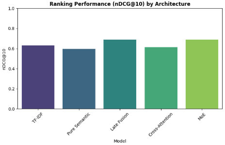
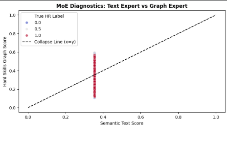
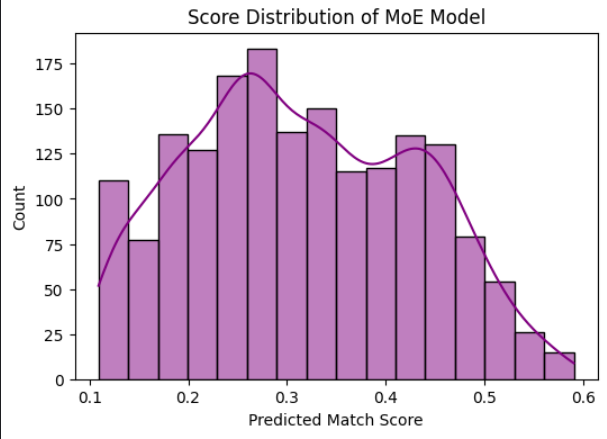

# Experimenting with Fusion Architectures for Resume-JD Matching

## What is this?

This notebook is an architectural comparison study for resume-to-job description (JD) matching. The goal is to figure out which model architecture best answers the question: *"How well does this candidate fit this job?"*

The problem with most ATS (Applicant Tracking Systems) out there is that they do keyword matching — if the resume doesn't use the exact words in the job description, the candidate gets filtered out. Someone who writes "built ML pipelines" instead of "machine learning engineering" might get rejected even if they're the best fit. We want to move past that.

The broader project has two signals available for matching:
- **Semantic signal** — what the resume and JD *mean*, captured via a transformer
- **Skill graph signal** — which concrete skills are mentioned and how they relate to each other, captured via pretrained GNN embeddings (2500 skills × 128 dimensions)

This notebook asks: what is the best way to combine those two signals?

---

## Dataset

- **Training set:** 6,241 resume–JD pairs
- **Test set:** 1,759 resume–JD pairs
- Each pair has a human-assigned match score (the target), extracted resume skills, extracted JD skills, and the full resume + JD text
- Skill embeddings are 128-dimensional GNN embeddings pretrained on a skill co-occurrence graph (loaded from `skill_embeddings.npy`)

---

## The Approach: An Architectural Evolution Study

Rather than jumping straight to the most complex model, we run four architectures in increasing order of sophistication. Each one adds something the previous one was missing. This lets us cleanly see what each addition actually contributes.

### Transformer Backbone

All four deep learning models use `cross-encoder/ms-marco-MiniLM-L-6-v2` as the text encoder. This is a cross-encoder — it takes the resume and JD concatenated together as a single 512-token input, which means the transformer can directly attend between resume tokens and JD tokens. The `[CLS]` token embedding at the end is used as the semantic representation of the pair.

All models are trained with AdamW (lr=1e-4), MSE loss, batch size 16, for 3 epochs.

---

## The Four Architectures

### 1. TF-IDF Baseline

Before any deep learning, we establish what traditional ATS systems actually do. TF-IDF with cosine similarity — a bag of words representation with no semantic understanding whatsoever.

This is the thing we're trying to beat. It's the "null hypothesis" for the whole project.

### 2. Pure Semantic


Text only, no skill graph at all. The transformer handles everything. This is roughly what systems like Resume2Vec do. It captures semantic meaning well (synonyms, paraphrasing) but has no structured understanding of which specific skills are present or absent. It also gives no signal about *which part* of the input drove the score — it's a black box.


### 3. Late Fusion


The first architecture that uses both signals. The text embedding and the skill graph embeddings are computed separately and concatenated before the final MLP. The MLP then has to figure out how to weight them.

**Key architectural decision — JD-Attended Skill Pooler:** The resume skill representation is not a naive mean of all resume skill embeddings. That would give equal weight to every skill the candidate has ever listed, diluting the signal from skills that actually match the JD. Instead, we use a cross-attention module where the **JD skills act as the Query and the resume skills are Key/Value**. This means resume skills that are semantically close to what the JD is asking for get high attention weights, and generic/unrelated skills get suppressed. The JD side uses a plain mean since the JD skills are already the target set by definition.


### 4. Cross-Attention


The transformer's token sequence actively attends over the graph skill embeddings. Specifically, the full token sequence is the Query, and the projected skill embeddings are the Keys and Values. This is a tighter integration than Late Fusion — the text representation is shaped by the skill information during the scoring computation rather than being combined at the end.


### 5. Mixture of Experts (MoE)


The key difference from all the others: the two signals are kept **separate all the way through** and only combined at the very end via a learned gating network. The gate takes the CLS embedding + the combined skill representation and outputs two weights (softmax, so they sum to 1) — one for the text expert, one for the graph expert.

This is the architecture we care most about. The reason isn't purely accuracy — it's that keeping the experts separate means we can inspect them. We can see the text score and graph score independently, understand which one drove the final decision, and in a downstream recourse system, tell a candidate *specifically* what to fix (improve your writing/framing vs. acquire these missing skills).

Same `JDAttendedSkillPooler` as Late Fusion is used here for the graph expert input.


---

## Why These Metrics?

HR doesn't care if a score is 0.73 vs 0.81 in absolute terms. What matters is whether the best candidates land at the top of the pile. So we don't evaluate on regression accuracy alone.

- **nDCG@10** — did the top 10 retrieved candidates match the human's top 10? Penalises highly ranked mistakes heavily
- **RBO (Rank-Biased Overlap)** — top-weighted list similarity, more robust to list length differences than nDCG
- **Spearman ρ** — overall monotonic ranking correlation across all pairs
- **MAE** — included for completeness, but least important for the actual use case

---

## Results

| Model | MAE ↓ | Spearman ↑ | nDCG@10 ↑ | RBO ↑ |
|---|---|---|---|---|
| TF-IDF | 0.3802 | 0.0908 | 0.6328 | 0.3927 |
| Pure Semantic | 0.3777 | 0.1193 | 0.5956 | 0.3792 |
| Late Fusion | 0.3528 | 0.2491 | **0.6885** | 0.4166 |
| Cross-Attention | 0.3627 | 0.1857 | 0.6135 | 0.4123 |
| **MoE** | 0.3565 | 0.2388 | **0.6893** | **0.4369** |


### MoE Expert Specialisation

- **Expert correlation: 0.1304** — the text expert and graph expert are producing meaningfully different scores (a correlation this low confirms they've specialised onto different aspects of the match rather than collapsing into the same representation)
- The gate weights are not uniformly 0.5/0.5 — the model has learned to trust each expert differently depending on the specific resume-JD pair






---

## What We Were Expecting vs What We Got

**TF-IDF** did pretty much exactly what was expected — competitive on nDCG (0.633) but very weak Spearman (0.091). It can find obvious keyword matches in the top results for some JDs but falls apart overall. The baseline hypothesis was confirmed.

**Pure Semantic** was a surprise in the wrong direction. It has the worst nDCG@10 of all models (0.596) and slightly worse RBO than TF-IDF. The hypothesis was that semantics alone would outperform keyword matching — and it does on MAE, but not on ranking. The cross-encoder model likely overfits to surface-level text similarity rather than developing a notion of candidate quality ranking. Worth noting: with only 3 epochs of fine-tuning, the model may simply not have enough signal to rank well across a diverse set of JDs.

**Late Fusion** is the most surprising result — it jumps to 0.689 nDCG and 0.417 RBO, the biggest single improvement in the entire table. Adding structured skill information has a dramatic effect. The JD-attended pooling is doing real work here: before the fix (naive mean pooling), Late Fusion actually scored *worse* than Pure Semantic. The attended pooling is what makes the graph signal useful.

**Cross-Attention** was expected to be the strongest model architecturally because it lets the text representation and skill graph interact at a deep level rather than just concatenating at the end. In practice it underperforms Late Fusion and MoE on almost every metric (nDCG 0.614, Spearman 0.186). One likely reason: the cross-attention projects skill embeddings from 128 to the transformer's hidden dimension (384) and attends over a variable-length padded sequence. The padding and projection may be introducing noise, or the attention mechanism may not be learning useful cross-modal alignment in just 3 epochs. This architecture probably needs more training time and a more careful setup to shine.

**MoE** lands where we wanted it — best RBO (0.437), near-tied best nDCG (0.689), best Spearman (0.239) among models that use both signals. Crucially, it achieves this while keeping the two experts separate. The expert correlation of 0.13 is strong confirmation that the two pathways are doing different things and not collapsing — the text expert is capturing semantic fit, the graph expert is capturing skill coverage, and the gate is combining them per-pair rather than with a fixed weight.

---

## Conclusions

The clearest takeaway is that **structured skill information matters a lot**, but only when it's used correctly. Naive mean pooling of all resume skills (treating them as a single averaged vector regardless of the JD) actively hurts performance — the graph score decreases as you add more general skills to a resume because they dilute the relevant ones. The JD-attended cross-attention pooler fixes this by making the resume skill representation query-conditional: only the resume skills that are relevant to what the JD is asking for contribute meaningfully.

The **MoE is the right architecture for this problem** — not just because it performs well, but because it gives interpretable, separable expert signals. The Cross-Attention being weaker than expected suggests that tight early fusion isn't necessarily better than clean late fusion, at least at this scale and training budget.

The **Spearman scores across the board are low** (best is 0.249). This is expected behaviour for a task like this — within a pool of candidates for a single JD, there are genuine ambiguities in human scoring. Two candidates with scores of 0.6 and 0.65 may be nearly identical, and the model can't be expected to perfectly resolve that ordering. nDCG and RBO are more meaningful indicators for the actual use case, and those numbers are much more encouraging.

---

## Files Saved

All four deep learning models are saved as state dicts to `/kaggle/working/`:

- `best_pure_semantic.pth`
- `best_late_fusion.pth`
- `best_cross_attention.pth`
- `best_moe_model.pth`

These are used in the downstream recourse phase where the MoE's separate expert scores drive candidate-specific feedback.

---

## Dependencies

```
transformers==5.2.0
torch
scikit-learn
scipy
seaborn
matplotlib
pandas
numpy
tqdm
```

Backbone model: `cross-encoder/ms-marco-MiniLM-L-6-v2` (HuggingFace)
