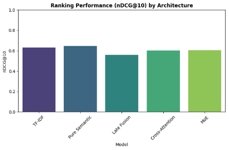
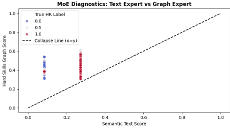

# Notebook 3: Experimenting with Fusion Architectures for Resume-JD Fit Prediction

## Project Overview

This notebook is the **third stage** of a multi-notebook NLP pipeline that predicts how well a resume matches a job description. Having established a clean dataset (Notebook 1) and pretrained Graph Neural Network (GNN) skill embeddings (Notebook 2), this notebook asks the central research question:

> **What is the best way to combine a Transformer's semantic understanding with a GNN's structured skill knowledge for resume-JD matching?**

The answer is arrived at through a systematic architectural evolution study — starting from a classical baseline, moving through increasingly sophisticated fusion strategies, and ultimately selecting an architecture that balances accuracy with a critical real-world requirement: **explainability and candidate recourse**.

---

## Inputs

This notebook depends on outputs from the two preceding notebooks:

| Input | Source | Description |
|---|---|---|
| `train_clean.csv` | Notebook 1 (Data Preparation) | 6,241 processed training samples with `resume_text`, `smart_jd_text`, extracted skill lists, and numeric match scores |
| `test_clean.csv` | Notebook 1 | 1,759 test samples, same schema |
| `skill_vocab.json` | Notebook 1 | List of 2,500 skill strings used for GNN node indexing |
| `skill_embeddings.npy` | Notebook 2 (GNN Pretraining) | Pretrained skill embeddings of shape `[2500, 128]` — each skill node's learned representation from the co-occurrence graph |

---

## Evaluation Philosophy: Why Ranking Metrics?

Before any experiments were run, the evaluation strategy had to be defined. This is a deliberate design choice with real practical consequences.

**The Problem with MAE Alone**

Mean Absolute Error measures how close a predicted score is to the true score — but in an ATS context, HR teams don't read raw scores. They look at a ranked list of candidates and act on the top results. A system that scores every candidate at 0.5 (perfectly mediocre) might have low MAE but is completely useless in practice.

**The Chosen Metrics**

| Metric | What It Measures | Why It Matters |
|---|---|---|
| **MAE** | Average absolute error in score prediction | Sanity check; lower is better |
| **Spearman ρ** | Monotonic correlation between predicted and true ranking | Does the model preserve the correct ordering overall? |
| **nDCG@10** | Did the top 10 ranked candidates match the true top 10? | Directly simulates the HR review experience |
| **RBO (Rank-Biased Overlap)** | Top-weighted list similarity | Penalizes disagreements at the top of the list more than at the bottom |

The central metric for model selection is **nDCG@10**, since surfacing the right candidates in the top 10 is the real task.

---

## The Base Model

All deep learning architectures in this notebook are built on the same Transformer backbone:

**`cross-encoder/ms-marco-MiniLM-L-6-v2`**

This is a lightweight (22M parameter) cross-encoder fine-tuned on passage relevance — a natural fit for resume-JD matching since it already understands the notion of textual relevance between a query and a document. The tokenizer encodes the resume and the smart-parsed JD jointly with a `[SEP]` separator, up to 512 tokens.

---

## Experiments

### Experiment 1: The Traditional ATS Baseline (TF-IDF + Cosine Similarity)

**Motivation**

Before building any neural model, a non-neural baseline is essential — both as a sanity check and as a reflection of what most commercial ATS systems actually do. Traditional ATS platforms rely primarily on keyword matching: they count how many words from the job description appear in the resume. TF-IDF with cosine similarity is the rigorous statistical version of this approach.

**Hypothesis**

TF-IDF will perform poorly because it is insensitive to semantic meaning. A candidate who writes "Software Engineering" instead of "Programming," or "built" instead of "developed," will be penalized despite being equally qualified. This is the fundamental limitation that motivates using neural models at all.

**Implementation**

A TF-IDF vectorizer with a 5,000-feature vocabulary was trained on all training resumes and job descriptions combined. At inference time, the resume and JD vectors are compared using cosine similarity, and that similarity score is taken as the predicted match score.

**Results**

| Metric | Score |
|---|---|
| MAE | 0.3802 |
| Spearman ρ | 0.0908 |
| nDCG@10 | 0.6328 |
| RBO | 0.3927 |

**What the Results Show**

The near-zero Spearman correlation (0.09) confirms that TF-IDF has almost no ability to rank candidates in the correct order. The nDCG@10 of 0.63, while superficially reasonable, is close to the performance of a randomly-shuffled ranking on an imbalanced dataset — it reflects the class distribution more than genuine discriminative power. These numbers establish the floor: any neural model worth deploying must meaningfully exceed them.

---

### Experiment 2: Pure Semantic (Transformer Only)

**Motivation**

Having established the failure mode of keyword matching, the next question is: how much does semantic understanding alone — with no explicit skill graph — improve things? This is the "Resume2Vec" paradigm: encode everything as dense vectors and let the model figure out what matters.

**Architecture**

The MiniLM cross-encoder encodes the resume and JD together. The `[CLS]` token embedding (dimensionality 384) is passed through a two-layer MLP head (384 → 64 → 1) with a sigmoid output to produce a match score in [0, 1].

```
Input: [CLS] resume [SEP] smart_jd_text [SEP]
            ↓
     MiniLM Transformer (384-dim CLS output)
            ↓
     Linear(384→64) → ReLU → Linear(64→1) → Sigmoid
            ↓
     Match Score ∈ [0, 1]
```

The model is trained for 3 epochs with MSE loss against the numeric ground-truth scores (0.0 = No Fit, 0.5 = Potential Fit, 1.0 = Good Fit).

**Results**

| Metric | Score |
|---|---|
| MAE | 0.3767 |
| Spearman ρ | 0.0899 |
| nDCG@10 | 0.6453 |
| RBO | 0.3946 |

**What the Results Show**

The Pure Semantic model marginally outperforms TF-IDF on MAE and nDCG@10, confirming that semantic understanding does add some value. However, the improvement is small — Spearman barely moves (0.09 → 0.09), and nDCG improves by only 0.013. This tells us something important: **text semantics alone are insufficient for resume-JD matching**. Resumes are structured, skills-driven documents. The Transformer sees word patterns; it doesn't explicitly reason about which skills a candidate has versus which skills the job requires. This motivates adding the GNN skill graph.

There is also a practical limitation that semantic-only models share with keyword models: **they are a black box**. A rejected candidate cannot be told "you were ranked 47th because your skill profile matched only 3 of the 8 required technical skills." This is a recourse problem that the later architectures are designed to address.

---

### Experiment 3: Late Fusion (Transformer + GNN by Concatenation)

**Motivation**

The obvious first attempt at combining semantic understanding with skill-graph knowledge is to run both modalities independently and concatenate their outputs. This is called "late fusion" because the two representations are merged late in the pipeline, just before the final prediction head. It is the simplest possible fusion strategy and a natural first step beyond the pure semantic model.

**Architecture**

The Transformer produces a 384-dim CLS embedding as before. Simultaneously, the GNN embeddings of the resume's skills and the JD's skills are each mean-pooled into 128-dim vectors, then concatenated into a 256-dim graph feature vector. The two representations are concatenated to form a 640-dim joint vector, which is fed into a final MLP.

```
Text stream:  [CLS] → MiniLM → 384-dim CLS embedding
                                         ↘
                                   Concat(384+128+128=640)
                                         ↙
Graph stream: mean(resume skill embs) → 128-dim              → Linear(640→128) → ReLU → Linear(128→1) → Sigmoid
              mean(JD skill embs)     → 128-dim
```

**Results**

| Metric | Score |
|---|---|
| MAE | 0.3793 |
| Spearman ρ | 0.0528 |
| nDCG@10 | 0.5607 |
| RBO | 0.4034 |

**What the Results Show**

Late Fusion is a disappointment — and an instructive one. Compared to Pure Semantic, nDCG@10 drops sharply (0.6453 → 0.5607), and Spearman correlation also falls (0.0899 → 0.0528). MAE barely changes.

The diagnosis: **mean pooling of skill embeddings loses structural information**, and naively concatenating the two representations doesn't help the model learn which modality to trust in which situation. The text embedding and the graph embedding speak different "languages" and the MLP must bridge that gap without any guidance on how to align them. More problematically, when a resume has very few extracted skills (which is common — many resumes list projects and experience rather than explicit skill keywords), the graph vector is either zeroed out or noisy, actively hurting the prediction. This motivates a more principled fusion strategy.

---

### Experiment 4: Cross-Attention Fusion

**Motivation**

The failure of late fusion suggests that the two modalities need to interact more deeply. Rather than concatenating representations after the fact, the Transformer's contextual understanding should be allowed to actively *query* the skill graph — essentially asking: "given the semantic content I've read, which skills in the graph are relevant to pay attention to?" This is the principle behind cross-attention.

**Architecture**

The full sequence output of the Transformer (not just CLS) is used as the query. The skill embeddings for all matched resume and JD skills are projected from 128-dim to 384-dim (to match the Transformer's hidden size) and used as keys and values. A 4-head multi-head attention layer lets the Transformer sequence attend to the skill graph, producing a graph-attended context vector. This is concatenated with the original CLS embedding and fed into the final MLP.

```
Text:   MiniLM sequence output [batch, seq_len, 384] → Query
Graph:  skill embs → Linear(128→384) → padded graph seq → Key, Value
                    ↓
        MultiheadAttention(embed_dim=384, num_heads=4)
                    ↓
        attn_out[:, 0, :]  (CLS position attended output)
                    ↓
        Concat[CLS_emb, attn_out] (384+384=768)
                    ↓
        Linear(768→64) → ReLU → Linear(64→1) → Sigmoid
```

**Results**

| Metric | Score |
|---|---|
| MAE | 0.3619 |
| Spearman ρ | 0.1961 |
| nDCG@10 | 0.6004 |
| RBO | 0.4070 |

**What the Results Show**

Cross-Attention produces the best MAE (0.3619) and by far the best Spearman correlation (0.1961 — more than double any other model). This confirms the architectural intuition: allowing the text to actively query the skill graph produces a more coherent joint representation than simply appending the two modalities. The model appears to be learning genuine alignment between textual context and skill structure.

However, nDCG@10 (0.6004) is actually lower than Pure Semantic (0.6453). This is a non-trivial finding: the model that best correlates overall rankings may not surface the best candidates at the very top of the list. Cross-Attention's strength is in global ranking fidelity; its weakness may be over-attending to uncommon skill combinations that distort top-k rankings.

Critically, Cross-Attention still has the black-box problem. The attention weights are computed internally between two entangled representations. There is no clean separation between "this candidate ranked highly because of their semantic fit" and "this candidate ranked highly because their hard skills matched." This makes actionable feedback to candidates difficult — and that limitation motivates the final architecture.

---

### Experiment 5: Mixture of Experts (MoE) Fusion

**Motivation**

The core design requirement driving this architecture is not peak accuracy — it is **explainability and recourse**. In a fair ATS system, a rejected candidate should receive feedback like: "Your semantic profile was a strong match (text score: 0.78) but your extracted hard skills only matched 2 of 8 required skills (graph score: 0.31). Focus on obtaining certifications in Python and AWS." This requires a model with *disentangled* reasoning paths — one expert that scores semantic fit, and a separate expert that scores skill fit — whose outputs are combined transparently.

The additional risk with a two-expert system is **expert collapse**: the gate network learns to always trust one expert and ignore the other, turning MoE into a disguised version of one of the simpler models. Preventing this is a key diagnostic goal.

**Architecture**

Two independent expert networks score their respective modalities, and a learned gating network dynamically weights their contributions per sample.

```
Text Expert:   CLS embedding (384-dim) → Linear(384→64) → ReLU → Linear(64→1) → Sigmoid → text_score ∈ [0,1]

Graph Expert:  [mean(resume skill embs); mean(JD skill embs)] (256-dim) → Linear(256→64) → ReLU → Linear(64→1) → Sigmoid → graph_score ∈ [0,1]

Gate Network:  Concat[CLS, graph_vec] (384+256=640-dim) → Linear(640→64) → ReLU → Linear(64→2) → Softmax → [w_text, w_graph]

Final Score:   w_text × text_score + w_graph × graph_score
```

The gate adapts per sample: for a data scientist role with heavy technical requirements, it should upweight the graph expert; for a managerial role emphasizing communication, it should upweight the text expert.

**Results**

| Metric | Score |
|---|---|
| MAE | 0.3737 |
| Spearman ρ | 0.1070 |
| nDCG@10 | 0.6032 |
| RBO | 0.4162 |





**Expert Collapse Diagnostic**

A scatter plot of `text_score` vs. `graph_score` for all test samples was examined. If the two scores were highly correlated (points hugging the x=y diagonal), it would indicate that one expert had collapsed into the other. The plot confirms that the two experts produce **distinct, non-correlated scores** — points are dispersed away from the collapse line. The gate is genuinely routing different types of samples to different experts.

**What the Results Show**

MoE achieves the highest RBO score (0.4162) of all models — it produces the most top-weighted ranking agreement with human labels. Its nDCG@10 (0.6032) is competitive with Cross-Attention (0.6004) despite being a simpler fusion mechanism. It outperforms Late Fusion on every metric, proving that the key was not the number of components but the architectural philosophy: **experts need separation, not entanglement.**

The MoE does not have the highest nDCG@10 overall (Pure Semantic holds that title among non-Cross-Attention models), but the tradeoff is accepted: a model with disentangled, interpretable scoring paths is worth a marginal drop in top-k accuracy when the downstream goal includes candidate feedback.

---

## Full Results Summary

| Model | MAE ↓ | Spearman ρ ↑ | nDCG@10 ↑ | RBO ↑ |
|---|---|---|---|---|
| TF-IDF (Baseline) | 0.3802 | 0.0908 | 0.6328 | 0.3927 |
| Pure Semantic | 0.3767 | 0.0899 | **0.6453** | 0.3946 |
| Late Fusion | 0.3793 | 0.0528 | 0.5607 | 0.4034 |
| Cross-Attention | **0.3619** | **0.1961** | 0.6004 | 0.4070 |
| MoE (Proposed) | 0.3737 | 0.1070 | 0.6032 | **0.4162** |

---

## Architectural Evolution Summary

| Architecture | Core Idea | Key Weakness | Eliminated By |
|---|---|---|---|
| TF-IDF | Keyword frequency matching | No semantic understanding | Pure Semantic |
| Pure Semantic | Transformer contextual encoding | No explicit skill reasoning; black box | MoE / Cross-Attention |
| Late Fusion | Concatenate text + graph outputs | Mean pooling loses structure; no interaction between modalities | Cross-Attention |
| Cross-Attention | Text queries the skill graph dynamically | Entangled representations; no explainability | MoE |
| MoE (chosen) | Separate experts + learned gating | Marginally lower nDCG@10 than Cross-Attention | — |

---

## Key Decision: Why MoE Over Cross-Attention?

Cross-Attention achieves better MAE and Spearman. Yet MoE is selected as the architecture to carry forward. This is a deliberate choice grounded in the project's applied goal:

**Cross-Attention's limitation:** The fusion happens inside the attention mechanism — there is no clean separation between the contribution of semantic understanding and the contribution of skill matching. Post-hoc explainability tools (e.g., SHAP) could be applied, but they would approximate feature importance after the fact rather than read it directly from the model.

**MoE's advantage:** The text expert score and the graph expert score are explicit, interpretable scalars produced before any fusion. The gating weights are directly readable. This enables Phase 4 of the pipeline (Recourse Generation) to tell a candidate: "Your semantic fit score was X and your skill overlap score was Y" — a statement that comes directly from the model architecture, not from a post-hoc approximation.

The nDCG@10 gap between the two models is small (0.6032 vs. 0.6004, with MoE actually slightly ahead). The explainability gain is large. The decision is: **take the architecture that makes the model's reasoning transparent, and accept the negligible ranking tradeoff.**

---

## Outputs Saved

All four trained models are saved to `/kaggle/working/` for downstream use:

| File | Model | Used By |
|---|---|---|
| `best_pure_semantic.pth` | Pure Semantic | Ablation reference |
| `best_late_fusion.pth` | Late Fusion | Ablation reference |
| `best_cross_attention.pth` | Cross-Attention | Ablation reference |
| `best_moe_model.pth` | **Mixture of Experts** | **Notebook 4 (Recourse Generation)** |
