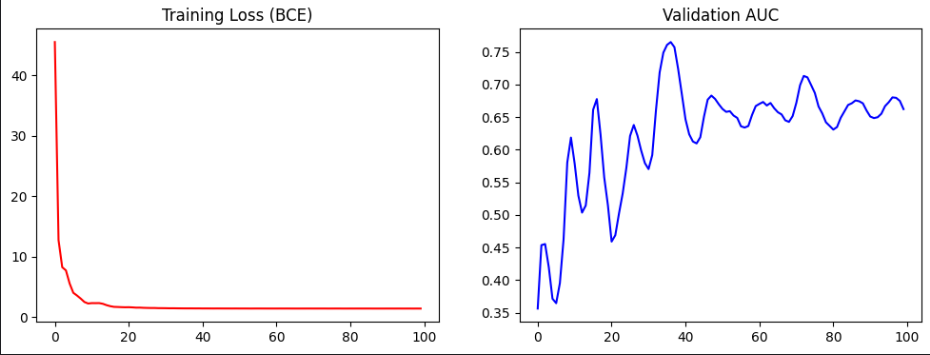

# Notebook 2: GNN Pre-training via Link Prediction

## Purpose

This notebook takes the skill vocabulary and co-occurrence graph built in Notebook 1 and **pre-trains a Graph Attention Network (GAT)** on it. The goal is to produce rich, contextual embeddings for each of the 2,500 skills - embeddings that capture not just the meaning of the skill name itself, but its position in the broader ecosystem of professional skills.

These embeddings are later used in Notebook 3 as an additional feature signal alongside the Transformer's text representations.

---

## Core Idea: Why Use a GNN at All?

A pure Transformer approach to resume-JD matching treats both documents as text and computes a similarity score based on token-level attention. This works reasonably well but has a fundamental limitation: **it cannot reason about skill adjacency**.

Consider this example:
- A job description requires `"PyTorch"` and `"deep learning"`.
- A resume lists `"TensorFlow"` and `"neural networks"`.

A Transformer trained on surface text might not recognise this as a strong match because the specific words differ. But a GNN trained on a skill co-occurrence graph *knows* that `PyTorch` and `TensorFlow` are neighbors in the skills graph — they appear together in the same job postings constantly. This relational information lets the model reason about **skill equivalence and proximity**, which text-only models miss.

---

## Architecture Design Decisions

### Option 1: Random Embedding Initialization (Transductive, Rejected)

The simplest GNN setup initialises each node as a learnable vector (`nn.Embedding`). The GNN then adjusts these vectors based on the graph structure during training.

**Problem: Embedding Collapse on Dense Graphs**

On a dense graph (like ours, with 135,000+ edges), the message-passing mechanism causes all nodes to average out toward the same vector after a few layers. This is called **oversmoothing** or **embedding collapse**. The result is that `"python"` and `"nursing"` end up with nearly identical embeddings — useless for discrimination.

This was empirically observed in early runs where cosine similarities between unrelated skills were all > 0.99.

---

### Option 2: LM-Initialized Node Features (Inductive, Chosen )

Instead of random initialization, we use a pre-trained Language Model (**MiniLM**: `cross-encoder/ms-marco-MiniLM-L-6-v2`) to generate the **initial node feature vector** for each skill.

**How it works:**
1. Each of the 2,500 skill strings is passed through MiniLM as a short text query.
2. The `[CLS]` token output (shape: `[384]`) is used as that skill's starting representation.
3. These 384-dimensional vectors become the input features `x` to the GAT.

**Why this works:**
- MiniLM already encodes semantic similarity. `"machine learning"` and `"deep learning"` start close together in embedding space; `"machine learning"` and `"customer service"` start far apart.
- The GNN then *refines* these semantically meaningful vectors using graph structure — it adjusts them based on real-world co-occurrence patterns.
- This jumpstart prevents collapse because the starting points are already well-separated.

**Why MiniLM specifically?**
- Very lightweight (90MB) and fast — encoding 2,500 skill strings takes ~15 seconds on GPU.
- Designed for sentence-level semantic similarity tasks, which aligns with comparing skill concepts.
- Small enough to run without consuming GPU memory needed for the main Transformer in Notebook 3.

---

## Graph Construction

### Input from Notebook 1
- **Nodes:** 2,500 skill strings from the LinkedIn vocabulary
- **Raw edges:** 644,571 skill co-occurrence pairs with weights (counts)

### Sparsification
We only keep edges where skills co-occurred in **at least 5 job postings**. This removes noise from coincidental co-occurrences (e.g., two rare skills that happened to appear together in one posting).

| Stage | Edge Count |
|---|---|
| Raw co-occurrence pairs | 644,571 |
| After min-weight filter (≥ 5) | 135,104 |
| After bidirectional expansion (PyG format) | 270,208 |

PyTorch Geometric requires directed edges, so each undirected edge `(A, B)` becomes two directed edges `(A → B)` and `(B → A)`.

### Edge Weight Normalization
Raw co-occurrence counts span a huge range (from 5 to ~6,000). Using raw counts as edge weights would cause gradient explosion during training — the optimizer would make enormous updates for edges with weight 6,000.

We apply **log normalization**: `weight = log(1 + count)`.

This compresses the range while preserving relative ordering (stronger co-occurrences still get higher weights).

---

## Model Architecture: `LM_Initialized_SkillGAT`

```
LM_Initialized_SkillGAT(
  (gat1): GATConv(384, 32, heads=4)   # 384 → 128 dim
  (gat2): GATConv(128, 128, heads=1)  # 128 → 128 dim
)
```

### Layer 1: `GATConv(384, 32, heads=4)`
- Takes the 384-dim MiniLM embeddings as input.
- Uses **4 attention heads**, each computing a 32-dim output.
- Multi-head attention (from the original "Attention is All You Need") lets the model learn different types of skill relationships simultaneously. One head might learn "technical tool" proximity; another might learn "domain" proximity.
- Outputs: 4 × 32 = 128 dimensions per node.

### Why Graph Attention Networks (GAT) over other GNN variants?

| GNN Type | Message Passing | Weighting | Suitability |
|---|---|---|---|
| GCN (Graph Convolutional) | Average neighbors | Fixed, by degree | Good for homogeneous graphs |
| GraphSAGE | Sample & aggregate | None | Good for inductive tasks |
| **GAT (Graph Attention)** | Weighted average | **Learned attention** | Best for heterogeneous skill relationships |
| GIN (Graph Isomorphism) | Sum neighbors | None | Best for structural equivalence |

GAT is the right choice here because:
- Not all skill neighbors are equally important. `"Python"` is more similar to `"data science"` than to `"customer service"`, even if both co-occur frequently.
- GAT learns which neighbors to attend to, rather than treating all co-occurring skills equally.
- Our edge attributes (log-normalized weights) can be fed as edge features to bias attention.

### Layer 2: `GATConv(128, 128, heads=1)`
- Refines the 128-dim representations with a second round of message passing.
- Single head at the output layer — we want a single, consolidated embedding, not multiple attention perspectives.

### Activation and Regularization
- **ELU activation** between layers: preferred over ReLU for GNNs because it allows small negative values, which helps with gradient flow in deep message-passing chains.
- **Dropout (p=0.1)**: Light regularization to prevent overfitting on the relatively small skill graph.
- **Weight decay (1e-4)**: Applied via the Adam optimizer — critical for preventing collapse by keeping embeddings spread out.

---

## Pre-training Task: Link Prediction

### Why Link Prediction?

We want the GNN to learn which skills are related. The most natural self-supervised task for this is **link prediction**: given a pair of skill nodes, predict whether there is an edge between them (i.e., whether they commonly co-occur in job postings).

This is an **unsupervised pre-training** step — no resume-JD labels are used here. The GNN learns a general representation of skill relationships from the LinkedIn data.

### Training Objective

For each batch:
1. **Positive examples:** All real edges in the graph (co-occurring skill pairs).
2. **Negative examples:** Randomly sampled non-edges (skill pairs that do NOT commonly co-occur), sampled to match the positive set size.

The prediction score for a pair `(u, v)` is the dot product of their embeddings: `z_u · z_v`.

Loss: **Binary Cross-Entropy with Logits (BCEWithLogitsLoss)**
- Positive pairs should have high dot product.
- Negative pairs should have low dot product.

### Optimizer
- **Adam** with `lr=0.005` and `weight_decay=1e-4`.
- The weight decay is especially important here — without it, the embeddings can drift toward an all-zeros collapsed solution.

---

## Training Results

Training was run for **100 epochs**.



| Epoch | Loss | Validation AUC |
|---|---|---|
| 10 | 2.2167 | 0.619 |
| 40 | 1.4033 | 0.685 |
| 70 | 1.3826 | 0.652 |
| 100 | 1.3764 | 0.662 |

### Interpreting the Results

**Loss:** Drops sharply from 2.2 to ~1.4 in the first 30 epochs, then plateaus. This is expected — the GNN quickly learns the coarse structure of the graph (which skills commonly appear together), then makes finer adjustments.

**Validation AUC: ~0.66–0.69**

A Validation AUC of ~0.66 on link prediction means the GNN can correctly rank a real skill connection above a random non-connection 66% of the time.

**Is this a good result?**

This is a difficult task because:
- The graph is **extremely dense** — 135,000 edges on 2,500 nodes means almost every pair of skills has some co-occurrence signal.
- Many "negative" pairs (randomly sampled non-edges) are actually *near*-edges — two skills that almost always appear together but fell below the threshold.
- The GNN is learning from co-occurrence only, with no fine-grained semantic signal about skill meaning.

An AUC of ~0.66 on this task is reasonable and, importantly, the **sanity check** below confirms the embeddings are meaningful — which is the actual goal.

---

## Sanity Check: Embedding Quality

The true test of the GNN embeddings is not the link prediction AUC, but whether the final embedding space makes semantic sense. We query the top-5 most similar skills to a set of probe skills across different domains:

### Results

**Skills most similar to PYTHON:**
- software development (Sim: 0.999)
- software engineering (Sim: 0.999)
- machine learning (Sim: 0.998)
- data science (Sim: 0.996)
- cloud (Sim: 0.996)

**Skills most similar to COMMUNICATION:**
- problem solving (Sim: 1.000)
- analytical skills (Sim: 0.999)
- problemsolving (Sim: 0.999)
- written communication (Sim: 0.999)
- negotiation (Sim: 0.999)

**Skills most similar to NURSING:**
- patient care (Sim: 0.999)
- first aid (Sim: 0.999)
- medical terminology (Sim: 0.998)

**Skills most similar to SALES:**
- customer service (Sim: 0.999)
- time management (Sim: 0.999)
- inventory management (Sim: 0.999)

**Skills most similar to DATA ANALYSIS:**
- excel (Sim: 0.999)
- reporting (Sim: 0.999)
- marketing (Sim: 0.999)

### What These Results Mean

The embeddings demonstrate clear **domain clustering**:
- Technical skills (`python`, `machine learning`, `software engineering`) cluster together.
- Healthcare skills (`nursing`, `patient care`, `medical terminology`) cluster together.
- Soft skills (`communication`, `problem solving`, `teamwork`) cluster together.
- Business skills (`sales`, `customer service`, `inventory management`) cluster together.

Crucially, there is **no collapse** — `python` and `nursing` are in different neighborhoods of the embedding space, even though the overall cosine similarities within each cluster are high (which is expected in high-dimensional spaces).

> **Note on high within-cluster similarities:** Values like 0.998–0.999 within a domain cluster reflect that similar skills genuinely have very similar co-occurrence patterns. This is real signal, not collapse.

---

## Outputs Produced

| File | Contents | Shape | Used By |
|---|---|---|---|
| `pretrained_skill_gat.pth` | Trained GAT model weights | — | Optional: for re-inference |
| `skill_embeddings.npy` | Final 128-dim embeddings for all 2,500 skills | `[2500, 128]` | Notebook 3 (as graph features) |

---

## Summary of Key Decisions

| Decision | Alternatives | Reason for Choice |
|---|---|---|
| LM-initialized node features (MiniLM) | Random `nn.Embedding` | Prevents embedding collapse on dense graph; provides semantic jumpstart |
| Graph Attention Network (GAT) | GCN, GraphSAGE, GIN | Learns which skill neighbors matter most via attention; handles edge weights |
| 2-layer architecture | 1 layer, 3+ layers | 1 layer = too shallow for relational reasoning; 3+ layers = oversmoothing risk |
| Link prediction pre-training | Node classification, contrastive | Unsupervised; directly trains on the task we care about (skill relatedness) |
| Min co-occurrence threshold = 5 | 1, 10, 20 | Removes noise without over-sparsifying; 135k edges is still a rich graph |
| Log-normalized edge weights | Raw counts, binary | Compresses range; prevents gradient explosion; preserves relative strength |
| Weight decay (1e-4) | No regularization | Critical for preventing embedding collapse on dense graphs |
