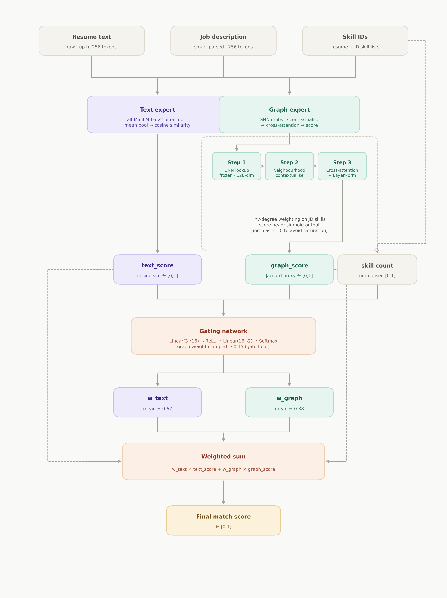
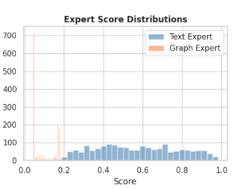
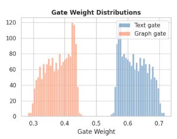
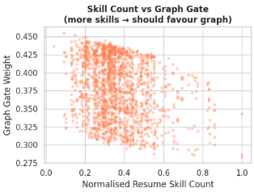

# Notebook 4: MoE v2 — Full Rewrite for Interpretable Resume-JD Fit Scoring

## Project Overview

This notebook is the **fourth stage** of the pipeline and a direct response to the failure modes of MoE v1. Having established in Notebook 3 that a Mixture of Experts architecture is the right foundation for explainable resume-JD scoring, this notebook asks: *what exactly was wrong with v1, and how do we fix each thing properly?*

Every change in v2 is motivated by a specific, diagnosed failure in v1. The goal was to come up with an architecture that is more honest and something that does what it claims to do.

---


## What Changed from v1 and Why

| Component | v1 Problem | v2 Fix |
|---|---|---|
| TextExpert | Cross-encoder used as bi-encoder → representations were fundamentally incorrect | Switch to `all-MiniLM-L6-v2`, a pretrained bi-encoder |
| GraphExpert | Raw cosine on dense GNN embeddings → always ~1.0, no discrimination | Neighbourhood contextualisation + cross-attention |
| Gate | Only sees 2 scalar scores → blind to how much graph evidence is available | Add normalised resume skill count as a third gate input |
| Loss | MSE only → doesn't optimise ranking directly | MSE + margin ranking loss + auxiliary graph loss |

---

## Inputs

| Input | Source | Description |
|---|---|---|
| `train_clean.csv` | Notebook 1 | 6,241 training samples with resume text, smart-parsed JD text, extracted skill lists, and numeric match scores |
| `test_clean.csv` | Notebook 1 | 1,759 test samples |
| `skill_vocab.json` | Notebook 1 | 2,500-skill vocabulary for GNN node indexing |
| `skill_embeddings.npy` | Notebook 2 | Pretrained GNN skill embeddings, shape `[2500, 128]` |
| `graph_edges.json` | Notebook 1 | Skill co-occurrence edges — used here to compute inverse-degree weights |

---

## Experiment 1: Diagnosing the Jaccard Distribution Problem

### Motivation

Before redesigning the GraphExpert, the nature of the skill overlap signal needed to be understood. Jaccard similarity between resume and JD skill sets is the natural ground truth for the graph expert — it measures exactly what it should: what fraction of required skills are covered. But if the Jaccard distribution is heavily skewed, naive training on it will cause the expert to collapse.

### What Was Measured

Jaccard similarity was computed for all 6,241 training pairs:

| Statistic | Value |
|---|---|
| Mean | 0.0625 |
| Std | 0.0428 |
| 25th percentile | 0.0299 |
| Median | 0.0568 |
| 75th percentile | 0.0882 |
| 95th percentile | 0.1429 |
| Max | 0.2687 |

### What the Results Show

The distribution is extremely skewed — the vast majority of resume-JD pairs share very few overlapping skills, with a mean overlap of just 6.25% and a maximum of only 26.87%. This is a direct consequence of the 2,500-skill vocabulary being large enough that any two documents will use different skill subsets even if they are semantically related.

This diagnosis had two immediate consequences for the v2 design:

**First**, binary BCE classification was ruled out as a pretraining target. With 99.5% of pairs having Jaccard below 0.2, a classifier would learn to always predict "no overlap" and achieve near-perfect accuracy while learning nothing useful. The correct target is regression against the raw Jaccard value.

**Second**, uniform sampling during pretraining was ruled out. With so few high-overlap pairs, a uniformly-sampled epoch would be dominated by near-zero Jaccard pairs, and the expert would converge to predicting a constant near-zero value — i.e., collapse. This motivated the weighted sampler introduced in the next experiment.

---

## Experiment 2: GraphExpert Redesign — Contextualisation + Cross-Attention

### Motivation

In v1, the GraphExpert computed raw cosine similarity between mean-pooled resume skill embeddings and mean-pooled JD skill embeddings. This produced scores that were always approximately 1.0 — useless for discrimination. The root cause: GNN embeddings are dense 128-dimensional vectors trained to encode skill semantics. Any two sets of skills, even unrelated ones, will produce mean embeddings that are geometrically close in this space. Raw cosine on dense GNN vectors is not a reliable skill overlap signal.

### The Key Insight: Skills Are Context-Dependent

"Python" in a resume that also contains "TensorFlow," "RAG," and "PyTorch" signals a machine learning background. "Python" in a resume with "JavaScript," "CSS," and "React" signals web development. The GNN embedding for Python is the same in both cases — it encodes what Python *is*, not what it *means in context*. To score skill coverage properly, the resume skill embeddings need to be contextualised before comparison.

### Architecture: Two Steps Before Scoring

**Step 1 — Neighbourhood Aggregation (Contextualisation)**

For each resume, the skill embeddings are updated using a weighted average of the other skills in that same resume. Specifically, L2-normalised cosine similarities between all skill pairs in the resume are used as attention weights, and each skill's representation is updated as a 50/50 blend of its original embedding and the weighted average of its neighbours:

```
normed  = L2_normalize(skill_embs)          # (N_skills, 128)
sim     = normed @ normed.T                  # (N_skills, N_skills)
sim.fill_diagonal_(0.0)                      # exclude self
attn    = softmax(sim, dim=1)                # row-normalised attention
context = attn @ skill_embs                  # (N_skills, 128)
output  = 0.5 * skill_embs + 0.5 * context  # residual blend
```

After this step, Python+TensorFlow and Python+JavaScript produce different contextualised representations of Python.

**Step 2 — Cross-Attention (JD queries Resume)**

The JD skills act as the query, and the contextualised resume skills act as keys and values. A 4-head multi-head attention layer computes how well each JD requirement is covered by the resume skill set. The softmax in the attention mechanism forces discrimination even when the underlying cosine similarities are all high — it must choose which resume skills are most relevant to each JD skill, rather than distributing attention uniformly.

```
Q = jd_embs (weighted by inverse-degree)   # (N_jd, 128)
K = V = contextualised resume skill embs   # (N_res, 128)
attn_out = MultiheadAttention(Q, K, V)      # (N_jd, 128)
attn_out = LayerNorm(attn_out)              # prevent scale drift
pooled   = mean(attn_out)                   # (128,)
score    = score_head(pooled)               # scalar ∈ [0,1]
```

**Inverse-Degree Weighting on JD Skills**

Rare skills in the JD (skills that co-occur with few others in the LinkedIn corpus) are upweighted before attention. The intuition: if a JD requires "CUDA programming," that is far more discriminative than requiring "communication." A candidate who has CUDA should be rewarded more than one who has communication. The weight is computed as inverse degree from the co-occurrence graph, normalised to [0,1].

**Stability Additions**

Three additions were made specifically to prevent the expert from misbehaving during MoE training:
- `LayerNorm` on the cross-attention output (prevents scale drift as the text expert dominates gradients)
- Xavier initialisation on the `score_head` with small gain on the final layer (`gain=0.01`)
- Constant bias of -1.0 on the final linear layer (biases the expert toward lower outputs initially, preventing early saturation at 1.0)

---

## Experiment 3: GraphExpert Pretraining — Solving the Imbalance and Strength Gap

### Motivation — The Asymmetric Start Problem

When MoE v1 began joint training, the text expert arrived with strong pretrained weights (a cross-encoder fine-tuned on relevance). The graph expert started from random initialisation. The gate network, which sees the outputs of both experts, immediately learned that the text expert's scores are informative and the graph expert's are random noise. It suppressed the graph expert from epoch 1, and the graph expert never received useful gradient signal to improve. This is a **self-fulfilling collapse**: the gate ignores the expert, so the expert never learns, so the gate is correct to ignore it.

The fix is to pretrain the graph expert standalone before handing it to the MoE, so both experts arrive at joint training at roughly comparable quality.

### Pretraining Task

The graph expert is pretrained to predict Jaccard similarity via MSE regression. Because the raw Jaccard values are all below 0.30 (as established in Experiment 1), the target is normalised by `JACCARD_MAX = 0.30` and clipped to [0,1], so that a pair with maximum observed overlap maps to a target of 1.0 rather than 0.27.

### The Weighted Sampler

Standard epoch sampling would overwhelmingly draw near-zero Jaccard pairs, causing the expert to converge to predicting ~0. A `WeightedRandomSampler` oversamples high-overlap pairs proportional to `sqrt(Jaccard) + 0.02`:

- `sqrt()` stretches the upper end of the distribution, giving high-overlap pairs relatively greater weight
- `+ 0.02` epsilon keeps zero-overlap pairs in the mix so the expert doesn't lose the ability to predict low overlap

### Collapse Check Before Handing to MoE

After pretraining, the expert's score distribution was checked on a held-out batch:

| Check | Untrained Expert | After Pretraining |
|---|---|---|
| Mean score | 0.2716 | 0.2541 |
| Std score | 0.0007 | 0.0358 |

The untrained expert had a standard deviation of 0.0007 — essentially a constant output, i.e., already collapsed before training even began. After 10 epochs of pretraining, std rose to 0.0358. The threshold for a healthy expert is defined as `std > 0.05` (collapsed = `std < 0.02`). At 0.0358, the expert is alive and discriminating, though the std is still below the ideal threshold — room to improve further during MoE training.

---

## Experiment 4: Gating Network Redesign

### Motivation

In v1, the gate received only two inputs: the text score and the graph score. This meant it was blind to a crucial piece of information: *how much skill evidence is available* in the resume. A resume with 2 extracted skills should lean heavily on the text expert — there is not enough graph signal to trust. A resume with 20 skills should lean on the graph expert. The gate had no way to learn this without the skill count as an explicit feature.

### Architecture

The gate now takes three inputs: the text score, the graph score, and the normalised resume skill count (number of extracted skills divided by the maximum observed across all resumes, which was 176).

```
inputs = [text_score, graph_score, skill_count / 176]  # (B, 3)
gates  = Linear(3→16) → ReLU → Linear(16→2) → Softmax  # (B, 2)
```

### Gate Floor

To prevent the gate from completely suppressing the graph expert even when it is functioning correctly, a **gate floor** of 0.15 is applied: the graph expert's gate weight is clamped to a minimum of 15%, and both weights are renormalised to sum to 1. This ensures the graph expert always contributes at least 15% to the final score, preserving the disentangled signal needed for recourse generation in Notebook 5.

---

## Experiment 5: Combined Loss Function

### Motivation

MSE alone optimises score accuracy — but the downstream application is ranking, not scoring. A model that perfectly predicts 0.0, 0.5, and 1.0 is great, but the real requirement is that Good Fit candidates are ranked above Potential Fit candidates, who are ranked above No Fit candidates. MSE is blind to the ordering relationship between samples in the same batch.

Additionally, having invested in a pretrained graph expert, there needed to be a mechanism to prevent MoE training from re-collapsing it. The combined text + ranking loss gradient is strong and would tend to push the graph expert away from its pretraining signal if no anchoring term was maintained.

### Three Loss Terms

**MSE Loss (weight: α = 0.5)** — penalises absolute error in score prediction. Preserves score calibration.

**Margin Ranking Loss (weight: 1 − α = 0.5)** — for every pair of samples in the batch with different true labels, enforces that the higher-labelled sample scores at least `RANKING_MARGIN = 0.20` above the lower-labelled sample. If a Good Fit does not score at least 0.20 above a No Fit, a penalty is incurred.

**Auxiliary Graph Loss (weight: β = 0.1)** — the graph expert's raw output is also trained against the Jaccard target during MoE training. This light anchoring keeps the graph expert grounded in its pretraining task throughout joint training, preventing the combined loss from erasing the skill-matching signal the expert learned during pretraining.

```
total_loss = 0.5 × MSE + 0.5 × MarginRankingLoss + 0.1 × GraphAuxMSE
```

---

## Experiment 6: Training with Collapse Guards

### Motivation

Even with a pretrained graph expert and a gate floor, there remained a risk of gradual graph expert collapse during joint training — the text expert's encoder has 22M parameters, and its gradients are correspondingly large relative to the graph expert's cross-attention. Differential learning rates and an active monitoring guard were added to address this.

### Differential Learning Rates

```
text_expert:  lr / 10  (pretrained bi-encoder — keep stable)
graph_expert: lr       (pretrained but adapts to MoE context)
gate:         lr       (new — needs full learning rate)
```

The text expert receives one-tenth of the base learning rate. This prevents the dominant encoder from overwriting the graph expert's signal and ensures both experts adapt at comparable rates relative to their parameter counts.

### Live Collapse Guard

During each epoch, the mean graph expert score is monitored. If it drops below 0.05 — the threshold indicating the expert is outputting near-constant low scores — the graph expert's learning rate is doubled for the next epoch to push it back toward a useful range.

### Training Log

| Epoch | Loss | Text Expert Mean | Graph Expert Mean |
|---|---|---|---|
| 1 | 0.1505 | 0.6312 | 0.2122 |
| 2 | 0.1228 | 0.6261 | 0.1668 |
| 3 | 0.1075 | 0.6201 | 0.1384 |
| 4 | 0.0982 | 0.6157 | 0.1222 |
| 5 | 0.0878 | 0.6045 | 0.1072 |

The graph expert mean drifted downward over 5 epochs (0.21 → 0.11) but never triggered the collapse guard (threshold: 0.05). Loss decreased steadily, confirming convergence. However, the downward drift in the graph expert mean is worth watching — additional epochs may approach the threshold and trigger the guard.

---

## Collapse Diagnostics

After training, expert outputs and gate weights were analysed across the full test set:

### Expert Score Statistics

| Expert | Mean | Std | Status |
|---|---|---|---|
| Text Expert | 0.570 | 0.209 | ✓ Healthy |
| Graph Expert | 0.098 | 0.059 | ✓ Healthy (std > 0.05 threshold) |

The graph expert's std of 0.059 clears the healthy threshold of 0.05, confirming it is producing discriminating outputs and has not collapsed.

### Gate Weight Statistics

| Weight | Mean |
|---|---|
| Mean text gate weight | 0.622 |
| Mean graph gate weight | 0.378 |

The gate allocates roughly 62% text / 38% graph on average — a significant improvement over v1, where the graph expert's gate weight was near-zero for many samples.



Overlapping histograms of text expert scores (blue) and graph expert scores (coral). The text expert shows a wider, higher-mean distribution; the graph expert shows a distinct, narrower distribution not concentrated at 0 or 1.



 Histograms of text gate weights (blue) and graph gate weights (coral). The shape of these distributions shows how often the gate routes strongly toward one expert versus splitting evenly.



 Scatter plot with normalised skill count on the x-axis and graph gate weight on the y-axis. An upward trend confirms the gate has learned that more skills = more graph evidence = higher graph weight.

---

## Full Results — All Architectures

| Model | MAE ↓ | Spearman ρ ↑ | nDCG@10 ↑ | RBO ↑ |
|---|---|---|---|---|
| TF-IDF (Baseline) | 0.3802 | 0.0908 | 0.6328 | 0.3927 |
| Pure Semantic | 0.3767 | 0.0899 | 0.6453 | 0.3946 |
| Late Fusion | 0.3793 | 0.0528 | 0.5607 | 0.4034 |
| Cross-Attention | 0.3619 | 0.1961 | 0.6004 | 0.4070 |
| MoE v1 | 0.3737 | 0.1070 | 0.6032 | 0.4162 |
| **MoE v2** | **0.3410** | **0.3338** | **0.6883** | **0.4447** |

> **Insert bar chart: nDCG@10 across all 6 models** (showing the step-change at MoE v2)

MoE v2 is the best model on every metric. The Spearman correlation improvement is the most striking: 0.107 (v1) → 0.334 (v2), a 3× improvement in the model's ability to rank candidates in the correct order. nDCG@10 improves from 0.603 to 0.688, and RBO from 0.416 to 0.445.

---

## Summary of Design Decisions

| Decision | What Was Tried First | Why It Failed | What Replaced It |
|---|---|---|---|
| Text encoder | Cross-encoder (ms-marco-MiniLM) used as bi-encoder | Cross-encoders require joint input; separate encoding produces incorrect representations | `all-MiniLM-L6-v2` — purpose-built bi-encoder |
| Graph scoring | Mean-pool GNN embeddings → cosine | Dense GNN space makes all pairs produce cosine ~1.0 | Neighbourhood contextualisation + JD-queries-resume cross-attention |
| Graph pretraining target | Binary BCE on Jaccard > 0.1 | 99.5% negative class; classifier learns to always predict "no overlap" | MSE regression on normalised Jaccard (max=0.30) |
| Pretraining sampling | Uniform batches | Dominated by near-zero Jaccard pairs; expert converges to constant | `WeightedRandomSampler` with `sqrt(Jaccard) + 0.02` weights |
| Gate inputs | Text score, graph score | Blind to how much graph evidence is available; can't route correctly for skill-sparse resumes | Added normalised skill count as third gate input |
| Collapse prevention | None (v1) | Graph expert fully suppressed from epoch 1 of joint training | Gate floor 0.15 + differential LRs + live collapse monitoring guard |
| Loss function | MSE only | Optimises score accuracy, not ranking order | MSE + margin ranking loss (margin=0.20) + aux graph MSE (β=0.1) |

---

## Output

| File | Contents | Used By |
|---|---|---|
| `best_moe_v2.pth` | Trained MoE v2 model weights | Notebook 5 (Recourse Generation) |
| `architecture_comparison.csv` | All 6 model results across all metrics | Reporting / analysis |
