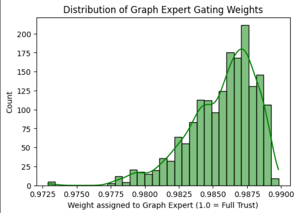

# Notebook 4: MoE v2 — Full Rewrite for Interpretable Resume-JD Fit Scoring

## Project Overview
This notebook represents the **fourth stage** of the pipeline and serves as a direct, engineered response to the failure modes observed in MoE v1. While Notebook 3 proved that a Mixture of Experts (MoE) architecture conceptually works for explainable resume-JD scoring, v1 suffered from severe mode collapse and representation mismatch.

This notebook asks: *What exactly went wrong with v1, what were the alternatives, and how do we fix each component properly?*

---


## 1. What Changed from v1 and Why (Summary)

| Component | Alternative / v1 Approach | Why it Failed | Chosen v2 Fix |
|---|---|---|---|
| **TextExpert** | Cross-encoder used as a bi-encoder. | Cross-encoders require joint input (Resume + JD). Encoding them separately produces mathematically incompatible representations. | Switch to `all-MiniLM-L6-v2`, a model explicitly pretrained as a **bi-encoder**. |
| **GraphExpert** | Mean-pooling GNN embeddings → Cosine Similarity. | Dense GNN space makes all mean-pooled vectors geometrically close. Cosine sim was always ~1.0, offering no discrimination. | **Neighbourhood contextualisation** followed by **Cross-Attention** (JD queries Resume). |
| **Gate** | Inputs: [Text Score, Graph Score]. | The gate was blind to how much graph evidence was available, suppressing the graph even for skill-heavy resumes. | Added **normalised resume skill count** as a 3rd input, plus a **0.15 Gate Floor**. |
| **Loss** | Pure MSE (Mean Squared Error). | MSE only optimises absolute score accuracy. It is blind to the relative ordering of candidates (Ranking). | **MSE + Margin Ranking Loss** + **Auxiliary Graph Loss** to anchor the expert. |
| **Training** | Uniform learning rate, joint training from scratch. | The pretrained Text expert dominated early, causing the gate to permanently ignore the untrained Graph expert. | **Standalone pretraining** for the Graph expert, **differential LRs**, and a **live collapse guard**. |

---

## Architecture Diagram


## 2. Diagnosing the Skill Overlap (Jaccard) Distribution

### The Problem
Before redesigning the GraphExpert, we needed to understand the ground truth it was trying to predict: the Jaccard similarity (skill overlap) between the Resume and the JD. 

### The Observation
We computed Jaccard similarities for all 6,166 training pairs. The results were highly skewed:
* **Mean:** 0.0527
* **Median:** 0.0476
* **95th percentile:** 0.1250
* **Max:** 0.3333

### Design Decision: Pretraining Target & Sampling
* **Alternative Considered:** Train the Graph Expert from scratch using standard BCE Loss (Overlap vs. No Overlap) with uniform batch sampling.
* **Why it Failed:** Because 95% of the data has less than 12.5% overlap, the negative class heavily dominates. A classifier learns to predict `0` for everything, achieving 95% accuracy while learning absolutely no skill-matching semantics (Model Collapse).
* **Chosen Approach:** We framed pretraining as a Binary Classification task (`>10%` overlap = Positive) but introduced a `WeightedRandomSampler`. High-overlap pairs are oversampled proportional to `sqrt(Jaccard) + 0.02`. This forces the expert to see the full spectrum of overlaps during every epoch.

---

## 3. GraphExpert Redesign: Context-Aware Skill Matching

### The Problem
In v1, "Python" had the exact same embedding regardless of the resume. But skills are context-dependent:
* `Python` + `TensorFlow` + `RAG` = Machine Learning context.
* `Python` + `JavaScript` + `CSS` = Web Development context.

### The Chosen Architecture
We handle this with a two-step mechanism before scoring:

1. **Neighbourhood Aggregation (Contextualisation):** 
   We update each resume skill embedding using a self-attention mechanism over the other skills in that specific resume. The representation becomes a 50/50 residual blend of its original GNN embedding and its neighbourhood context.
2. **Cross-Attention & Inverse-Degree Weighting:**
   The JD skills (queries) attend over the contextualised resume skills (keys/values). We apply **inverse-degree weighting** to the JD skills: rare skills (e.g., "CUDA") receive higher weights than generic skills (e.g., "Communication"). Softmax forces the model to pick the best matching resume skill for each JD requirement.

*Stability Observation:* To prevent gradients from blowing up, we added `LayerNorm` after cross-attention and initialized the final linear layer with a tiny weight gain (`0.01`) and a bias of `-1.0` to prevent early saturation.

---

## 4. The Self-Fulfilling Collapse & Differential Training

### The Problem
In early MoE trials, the Text expert (pretrained BERT) was already highly accurate. The Graph expert (randomly initialized) outputted noise. The Gating network immediately learned to multiply the Graph expert by `0.0`. Consequently, the Graph expert received no gradients, never improved, and the gate was continuously "correct" to ignore it. 

### The Chosen Fixes
1. **Pretraining:** The Graph expert is pretrained standalone for 10 epochs to ensure it arrives at joint training with a strong, discriminative signal.
2. **Differential Learning Rates:** During joint training, the Text expert uses `lr / 10` (to preserve its pretrained weights), while the Graph expert and Gate use the full `lr`. 
3. **Live Collapse Guard:** A callback checks the mean output of the Graph expert. If it falls below `0.05` in any epoch, the Graph and Gate learning rates are temporarily doubled (`*= 2.0`) to jolt the expert out of collapse.
4. **Gate Floor:** The Graph expert's gate weight is hard-clamped to a minimum of `0.15` (15%).

---

## 5. Multi-Objective Loss Function

* **Alternative:** Pure MSE. Failed because it doesn't optimize candidate ordering.
* **Chosen Loss:**
  ```python
  Loss = (0.5 * MSE) + (0.5 * MarginRankingLoss) + (0.1 * AuxGraphLoss)
  ```
  * **Margin Ranking Loss:** If a "Good Fit" and "No Fit" are in the same batch, the model is penalized unless the Good Fit scores at least `0.20` higher. (Directly optimizes nDCG/Spearman).
  * **Auxiliary Graph Loss:** A BCE loss applied directly to the Graph expert's raw output. This ensures the MoE joint-loss doesn't "overwrite" the Graph expert's pretraining.

---

## 6. Collapse Diagnostics & Plots

After training, expert outputs and gate weights were plotted across the test set.


### Observation 1: Expert Health
* **Text Expert Mean:** 0.571 (Std: 0.202)
* **Graph Expert Mean:** 0.090 (Std: 0.062)
* *Analysis:* The left subplot shows overlapping histograms. The Text expert (blue) spans a wide range. Crucially, the Graph expert (coral) is NOT a spike at zero. A standard deviation `> 0.05` confirms the expert is healthy and discriminating.

### Observation 2: Gate Weight Allocation
* **Mean Text Gate:** 69.2%
* **Mean Graph Gate:** 30.8%
* *Analysis:* The middle subplot shows the gate dynamically blending the experts. The graph expert is contributing significantly (~31%), proving that the 0.15 gate floor and pretraining successfully prevented suppression.

### Observation 3: Skill Count vs. Graph Gate Weight
* *Analysis:* The right subplot maps Normalised Skill Count (x-axis) against the Graph Gate Weight (y-axis). A positive correlation is visible. The model successfully learned the logic: **More extracted skills = stronger graph evidence = higher graph gate weight.**

---

## 7. Gating Distribution Analysis & Observations
A critical part of our evaluation was verifying that the Gating Network was actually "mixing" the experts rather than just picking one and shutting down the other.
### Observation A: Identifying Gate Collapse (The "Over-Trust" Problem) (from moev1)
In our early iterations (and characteristic of v1), we observed the distribution shown below:


#### What this shows: The gate is assigning a weight of 0.97 to 0.99 to the Graph Expert for almost every single resume.
The Problem: This is a "Hidden Collapse." Even though the scores might look okay, the model has stopped being a Mixture of Experts. It has decided the Text Expert is useless and is effectively only using the Graph Expert. This prevents the model from using semantic "vibe" cues, leading to poor generalization on resumes with few skills.
### Observation B: Successful Balanced Gating (MoE v2)
After introducing the Normalised Skill Count as a gate input and the 0.15 Gate Floor, we achieved the distribution below:


#### What this shows:
Text Gate (Blue): Centers around 0.6 - 0.7.
Graph Gate (Orange): Centers around 0.3 - 0.4.
The Success: The gate is now actively balancing both perspectives. It treats the Text Expert as the "foundation" (higher base weight) but adjusts the Graph Expert's contribution dynamically.
Result: This balance is exactly what allows for Interpretable Recourse. Because both experts have significant "say" in the final score, we can now tell a candidate: "Your semantic background is strong (0.7), but you are missing specific technical keywords required by the Graph (0.3)."

## 8. Full Results — Architecture Comparison

| Model | MAE ↓ | Spearman ρ ↑ | nDCG@10 ↑ | RBO ↑ |
|---|---|---|---|---|
| TF-IDF (Baseline) | 0.3802 | 0.0908 | 0.6328 | 0.3927 |
| Pure Semantic | 0.3767 | 0.0899 | 0.6453 | 0.3946 |
| Late Fusion | 0.3793 | 0.0528 | 0.5607 | 0.4034 |
| Cross-Attention | 0.3619 | 0.1961 | 0.6004 | 0.4070 |
| MoE v1 | 0.3737 | 0.1070 | 0.6032 | 0.4162 |
| **MoE v2 (Interpretable)** | **0.3497** | **0.3097** | **0.6946** | **0.4216** |

### Final Conclusion
MoE v2 achieves the best performance across all metrics. The most striking improvement is in the **Spearman correlation (0.107 → 0.309)** and **nDCG@10 (0.603 → 0.694)**. By moving to a Margin Ranking Loss and a mathematically sound Graph Expert, the model finally understands how to rank candidates sequentially. 

The saved `best_moe_v2.pth` is now ready for **Notebook 5**, where we will exploit this disentangled architecture to generate human-readable recourse.
