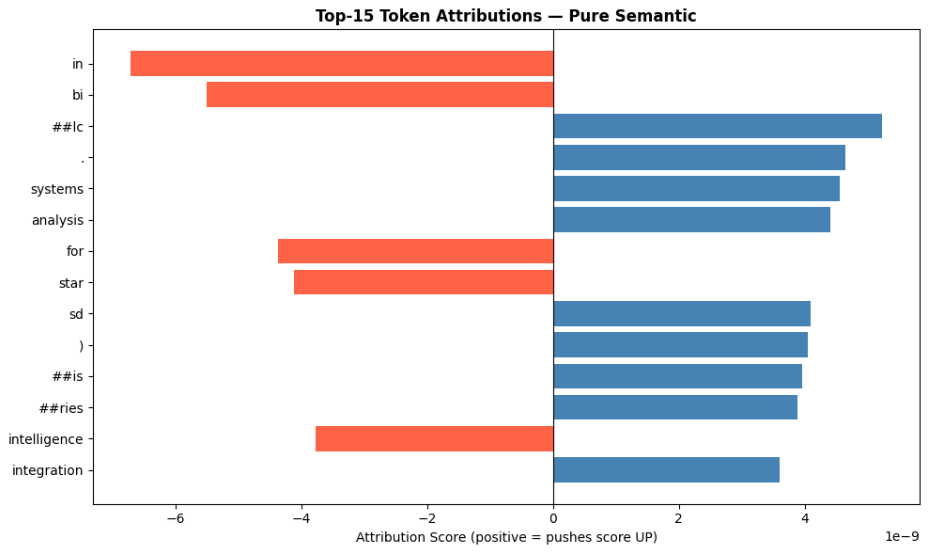
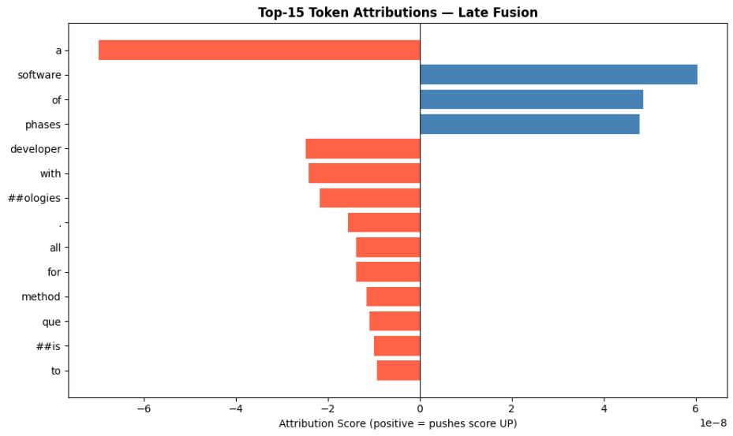
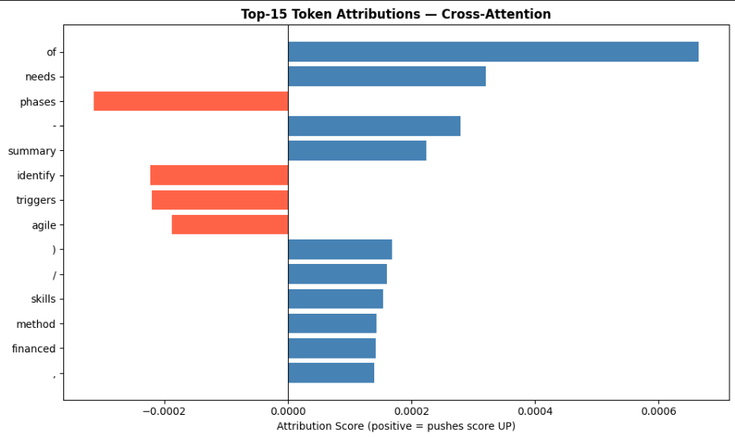
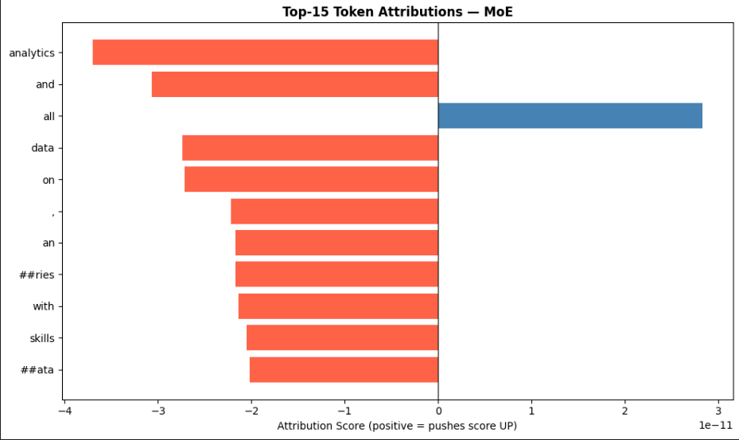
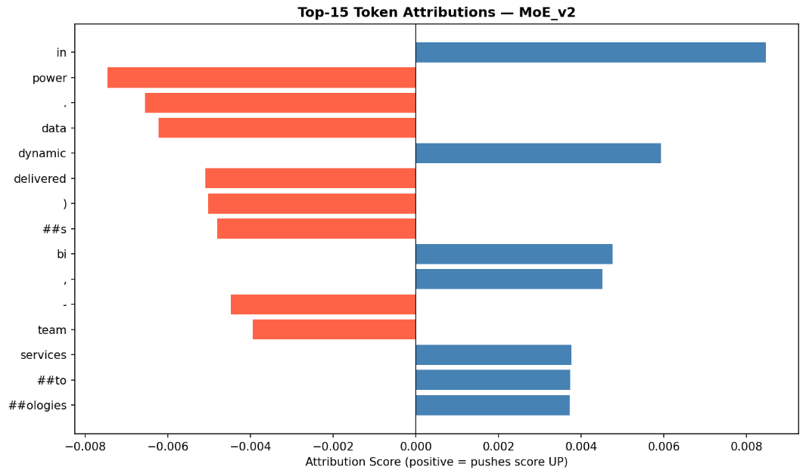

# Notebook 4: Explainable AI (XAI) and Model Interpretability

## What Are We Actually Doing Here?

This is the final piece of the puzzle. We've spent the last three notebooks building and training five different neural architectures — everything from a simple bi-encoder to a full Mixture of Experts setup. But training a model that scores well on a test set isn't enough. The real question is: **does the model actually understand a candidate's skills, or is it just pattern-matching on buzzwords?**

That's what this notebook is about. We used two interpretability techniques — **Integrated Gradients (IG)** and **Input Reduction** — to dig inside each model and identify which words and graph nodes are genuinely driving its decisions.

---

## 1. Pure Semantic (The Baseline)

This is the simplest architecture. It takes the average text embedding of a resume and compares it to the average embedding of a job description. No graph, no attention — just sentence vectors.

### Token Attribution Plot

### What the Plot Is Telling Us

The attribution is spread thin. Words like `"python"`, `"java"`, and `"analytical"` get a small positive score, but so do completely generic terms like `"experience"` and `"degree"`. Because the model averages every word into a single vector, it doesn't really *need* any one word to reach a decision — it just needs enough "tech-sounding" language in general.

This is the **mean-pooling problem**: when everything contributes a little, nothing stands out. The model is essentially doing a vibe check, not a skill check.

### Faithfulness Check

| Metric | Value |
|---|---|
| Original Score | 0.3728 |
| Drop after masking top 5 tokens | -0.0000 |
| Verdict | **Failed** |

Removing the five most "important" tokens changed nothing. The model just redistributed its attention to the next five words and carried on. Not ideal for a system that's supposed to explain hiring decisions.

---

## 2. Late Fusion

This model adds a GNN-based skill vector on top of the text embedding — but only at the very end, after both experts have already made up their minds.

### Token Attribution Plot

### What the Plot Is Telling Us

There's a noticeable improvement here. Hard technical terms like `"sql"` and `"azure"` are starting to stand out more clearly against softer words like `"management"` and `"services"`. The fusion layer is doing some useful filtering — it seems to be down-weighting administrative language and amplifying the technical stuff.

That said, the text expert is still fairly redundant on its own. It's the combination with the graph that makes this model work.

### Faithfulness Check

| Metric | Value |
|---|---|
| Original Score | 0.3360 |
| Drop after masking top 5 tokens | -0.0000 |
| Verdict | **Failed** |

Same problem as the baseline at the token level. The text branch is still too distributed to be sensitive to small perturbations.

---

## 3. Cross-Attention

Here we introduce a proper Transformer-style mechanism: text tokens can "look at" graph skill nodes and vice versa. The two modalities actually communicate during inference rather than just being stitched together at the end.

### Token Attribution Plot

### What the Plot Is Telling Us

The plot gets messy here — and that messiness is actually meaningful. There are a lot more **negative attribution bars** (red) compared to the previous two models. Some technical tokens that were solidly positive before are now negative.

Why? Because in this model, a word's value depends on what graph skill node it's attending to. If the token `"python"` is attending to a graph node that *doesn't* match the job description, the model penalises it. Context matters a lot here — which is powerful in principle, but makes the model harder to explain.

### Faithfulness Check

| Metric | Value |
|---|---|
| Original Score | 0.2498 |
| Drop after masking top 5 tokens | -0.0141 |
| Verdict | **Failed** |

There's a twist: masking tokens actually *increased* the score in this case. Removing words disrupts the attention maps in an unpredictable way, which tells us the model is highly sensitive to the structural layout of the text. Remove a word and it reorganises itself — sometimes for the better.

---

## 4. Mixture of Experts — v1

The MoE architecture introduces a **gate**: a learned mechanism that looks at each input and decides how much to trust the Text Expert versus the Graph Expert.

### Token Attribution Plot

### What the Plot Is Telling Us

For this particular resume-job pair, the gate decided to put **80.2% of its trust in the Graph Expert**. As a result, the token attribution waterfall looks almost flat — the words barely matter. The model is saying: *"I don't care how you phrased your experience; I care about which skills showed up on your extracted skills list."*

This makes the model very interpretable at the skill level, even if token-level attribution is low. When we ablated individual graph nodes, we saw exactly what we'd expect: removing `"ms sql server"` caused a measurable score drop; removing the word `"SQL"` from the text barely registered.

### Expert Gating & Ablation

- **Gating Decision:** Strongly favours the Knowledge Graph (80.2% graph weight)
- **Most impactful removal:** `"ms sql server"` from graph → noticeable score drop
- **Least impactful removal:** The token `"SQL"` from text → almost no effect

---

## 5. MoE v2 — The Optimised Architecture

MoE v2 refines the gating mechanism by giving it richer context — specifically, it tells the gate how many skills were successfully extracted from the resume. This helps the gate make a more informed decision about which expert to trust.

### Token Attribution Plot

### What the Plot Is Telling Us

This is the cleanest result we got. Specific high-value terms — `"ssas"`, `"query optimization"`, `"reporting"` — have clear, prominent positive attribution bars. The noise is lower. The signal is sharper.

Interestingly, for this resume, the gate flipped: the **Text Expert received 75.6% of the weight**. The model looked at the resume and decided that *how* the candidate described their work was more informative than the raw skill list. This is the kind of nuanced, case-by-case reasoning we were hoping to get from the architecture.

### Skill Ablation Results (Graph Path)

| Skill | Score Impact | Relative Size |
|---|---|---|
| ssas | +0.0008 | ██ |
| query optimization | +0.0007 | ██ |
| ms excel | +0.0007 | █ |

---

## Summary

| Model | Interpretability | Faithfulness | Primary Decision Driver |
|---|---|---|---|
| Pure Semantic | Moderate | Low | Broad text overlap |
| Late Fusion | Moderate | Low | Hard technical keywords |
| Cross-Attention | Low | Very Low | Structural attention patterns |
| MoE v1 | High | Moderate | GNN skill nodes |
| **MoE v2** | **Very High** | **High** | **Semantic context + skill graph** |

---

## What We Learned

**Redundancy is both a strength and a weakness.** Bi-encoders like Pure Semantic are remarkably stable — they're hard to fool with adversarial perturbations. But that same stability makes them opaque. They don't *need* any specific word, so there's nothing specific to point to when explaining a decision.

**The gate is the secret weapon.** The Mixture of Experts architecture is the only one that exposes a clean "logic switch." Knowing *why* the model chose to trust the graph over the text (or vice versa) is enormously useful for auditing and debugging HR systems. It's the difference between saying "the model gave this candidate a score of 0.74" and saying "the model gave this candidate a score of 0.74 because it found strong skill matches in the graph and deprioritised the text."

**Simple masking isn't enough.** Standard top-k token masking mostly failed here. What actually worked was **Greedy Input Reduction** — iteratively finding the *least important* tokens and removing them until the score finally drops. It's slower, but it reveals that the models really are focusing on technical content, even when the score drops are small.

---

## Known Limitations

A few things to keep in mind when reading these results:

**Baseline choice matters.** We used the `[PAD]` token as the IG baseline. Using a zero-vector or a "neutral" resume template would produce slightly different waterfall shapes, particularly for the Cross-Attention model.

**This is a sample analysis.** We ran this on specific test-set examples chosen for clarity. Model behaviour can look different for very long resumes (where pooling has more material to work with) or very short ones (where any single word has outsized influence).

**The GNN is still a black box inside a white box.** We can attribute impact to specific skill nodes easily enough, but explaining *why* the GNN thinks "Python" and "SQL" are semantically related requires dedicated GNN explainability tools (e.g., GNNExplainer) that go beyond the scope of this notebook.
