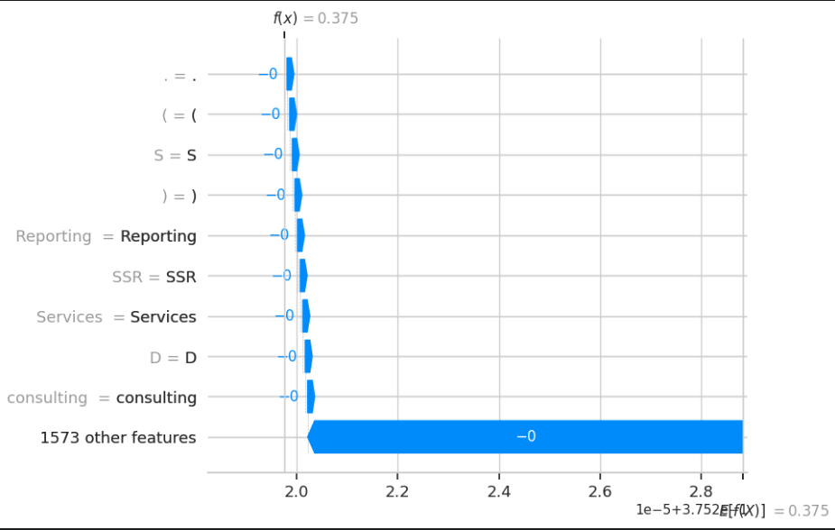
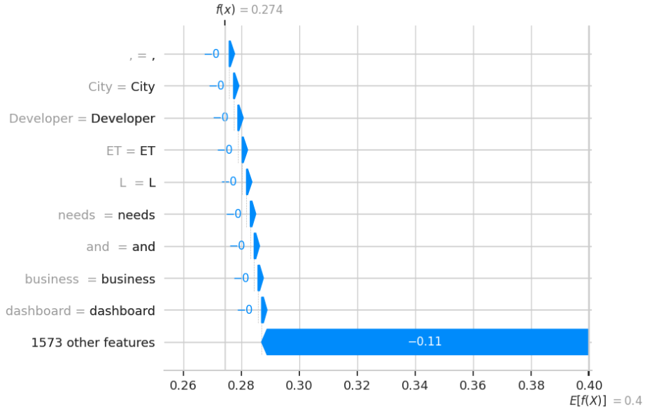
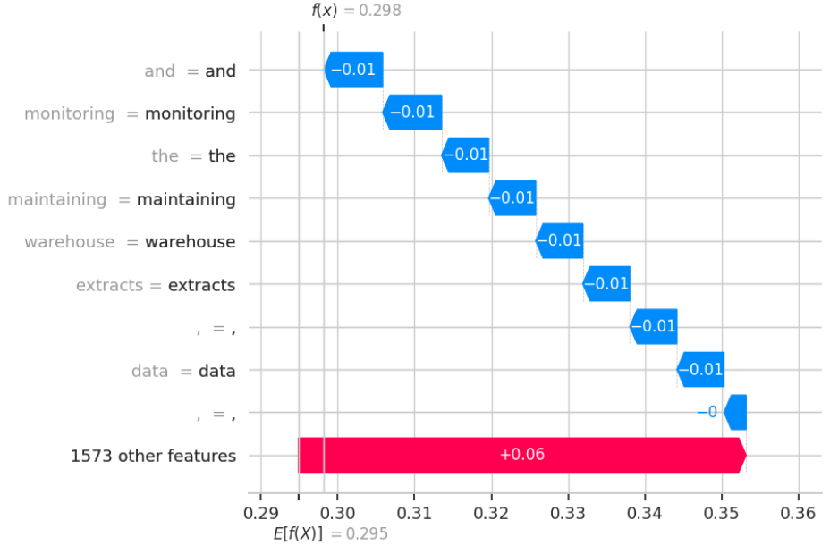
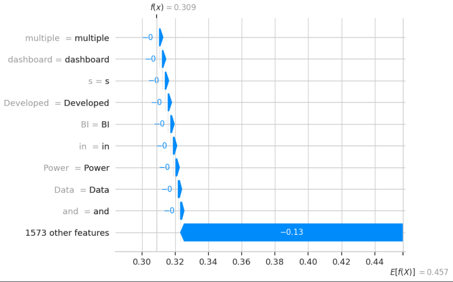
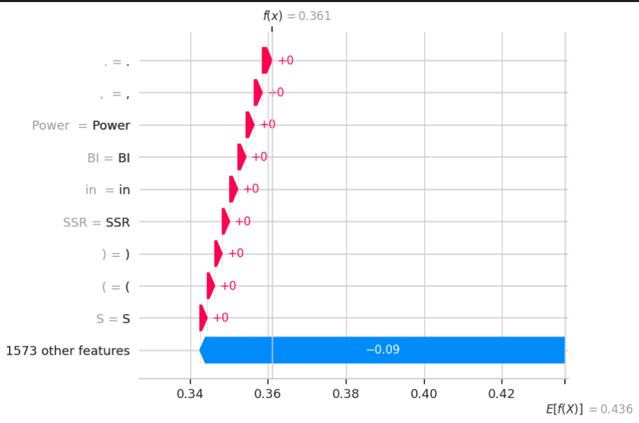

# SHAP-Based Explainability Analysis for Resume–Job Description Matching

**Project:** Multimodal Resume–JD Matching — Interpretability Study  
**Models Evaluated:** Pure Semantic, Late Fusion, Cross-Attention, MoE v1, MoE v2  
**Evaluation Set:** N = 20 samples  
**Hardware:** NVIDIA Tesla T4 (Kaggle)  
**Base Transformer:** `cross-encoder/ms-marco-MiniLM-L-6-v2`

---

## Table of Contents

1. [Overview](#1-overview)
2. [Architecture Summary](#2-architecture-summary)
3. [Design Choices & Rationale](#3-design-choices--rationale)
4. [SHAP Methodology](#4-shap-methodology)
5. [Sanity Check Results](#5-sanity-check-results)
6. [Waterfall Plot Analysis](#6-waterfall-plot-analysis)
7. [Faithfulness Evaluation](#7-faithfulness-evaluation)
8. [Cross-Model Comparison & Discussion](#8-cross-model-comparison--discussion)
9. [Conclusions](#9-conclusions)
10. [Limitations & Future Work](#10-limitations--future-work)

---

## 1. Overview

This report documents the SHAP (SHapley Additive exPlanations) interpretability analysis of five resume–job description matching architectures. The goal is to understand *what* each model is actually relying on when it assigns a match score — which tokens in a resume genuinely drive the prediction, and whether those attributions are faithful to the model's actual behaviour.

This is not just a post-hoc visualisation exercise. The faithfulness evaluation tests whether the tokens SHAP identifies as important actually *cause* score changes when removed — which is the real bar for whether an explanation is trustworthy. The results here reveal a meaningful spread across architectures, from a near-degenerate Pure Semantic model to an MoE v1 that shows the clearest causal structure.

---

## 2. Architecture Summary

All five models share the same transformer backbone (`cross-encoder/ms-marco-MiniLM-L-6-v2`) but differ in how — and whether — they incorporate GNN-based skill embeddings alongside text.

**Pure Semantic** is the simplest baseline. It takes only the CLS token from the transformer and passes it through a 2-layer MLP (384 → 64 → 1, Sigmoid). There is no graph component at all. This model represents an upper bound on what text-alone matching can do.

**Late Fusion** extends the baseline by appending mean-pooled GNN skill embeddings for both the resume and JD to the CLS vector before the MLP. The combined input is 640-dimensional (384 text + 128 resume skills + 128 JD skills). Graph and text information are mixed only at the final layer.

**Cross-Attention** is more architecturally sophisticated. Rather than simply concatenating skill embeddings, it uses a 4-head MultiheadAttention layer where the full transformer token sequence attends over the projected graph skill sequence. The CLS token and the attended output are concatenated before the final MLP. This allows skill context to influence how the transformer *reads* the text, not just what is appended to it.

**MoE v1 and MoE v2** are Mixture-of-Experts architectures with separate text and graph expert branches. A learned gating network (conditioned on both the CLS embedding and graph features) produces a soft weighting between the two expert outputs. The final score is `gate_text × text_score + gate_graph × graph_score`. MoE v2 is a later variant of the same architecture — the difference likely lies in training configuration or data split.

---

## 3. Design Choices & Rationale

### Cross-Encoder Tokenisation

A key decision throughout is treating the resume–JD pair as a single cross-encoder input. Both texts are fed together to the tokeniser:

```python
tokenizer(resume_texts, [fixed_jd_text] * B, ...)
```

This matters for interpretability. When resume and JD are encoded together, the transformer can attend across them — so SHAP is explaining *match relevance*, not a standalone resume quality score. A wrapper that only passed the resume text would produce explanations for the wrong quantity entirely.

### The `DynamicMultiModalWrapper` and Why It Was Rewritten

An earlier version of the wrapper had two silent bugs that would have invalidated all graph-model SHAP explanations.

The first was that `jd_ids` was hardcoded to `[]` for every SHAP call. This meant that the graph expert in LateFusion, CrossAttention, and both MoE models was permanently receiving zero vectors for the JD side — the JD's graph features simply did not exist as far as the model was concerned during explanation. The fix pre-extracts the JD's skill IDs once at wrapper construction and reuses them correctly:

```python
self._jd_skill_ids = self._extract_skills_single(fixed_jd_text)
jd_ids = [self._jd_skill_ids] * B
```

The second issue was that the wrapper scored resumes in isolation rather than against the JD. After the fix, every SHAP call pairs a (possibly perturbed) resume with the fixed JD, so attributions reflect the actual matching signal.

### Faithfulness: Dynamic vs. Static Mode

The faithfulness evaluation uses two ablation modes deliberately. In **Dynamic mode**, after masking the top-K tokens in the resume text, skill IDs are re-extracted from the ablated text. This tests the model end-to-end — if an ablated token was the only occurrence of a skill keyword, the model loses both the text signal and the graph signal for that skill simultaneously. In **Static mode**, the original pre-computed skill IDs are preserved and only the text is ablated, isolating the text pathway's contribution and quantifying how much the graph branch compensates when text is disrupted. The faithfulness threshold is set at `0.02` — a score drop of at least 2 percentage points is required to count as a faithful attribution.

### Token-Level Masking

The `mask_tokens_in_text` function operates in token-index space, replacing selected positions with `[MASK]` before reconstructing the string via `tokenizer.convert_tokens_to_string()`. This avoids a subtle but important bug: naive `str.replace()` on subword tokens would corrupt words (e.g., removing `##ware` from `software` yields `soft` — a different token with a different meaning, not the intended blank).

---

## 4. SHAP Methodology

The `shap.Explainer` is used with `shap.maskers.Text(tokenizer)`. This masker replaces tokens with the tokeniser's MASK token and evaluates the model across coalitions of masked/unmasked tokens to compute Shapley values — the marginal contribution of each token, averaged over all orderings of the token set.

The explainer is instantiated **once per model** outside the sample loop, which ensures a consistent background distribution across all 20 evaluated samples. The wrapper's `fixed_jd_text` and `_jd_skill_ids` are updated per sample inside the loop to ensure each resume is correctly paired with its own JD.

Each evaluated sample produces 1,582 token-level SHAP values — matching the tokenised length of the resume–JD pair. Notably, this exceeds the model's maximum sequence length of 512, which generates a tokenisation warning during inference. The model silently truncates to 512, meaning SHAP values for positions beyond 512 correspond to tokens the model never saw. This is a known limitation discussed in Section 10.

---

## 5. Sanity Check Results

Before the main evaluation, a set of sanity checks was run on each model to verify the SHAP setup. Results are shown below.

| Check | Pure Semantic | Late Fusion | Cross-Attention | MoE v1 | MoE v2 |
|---|:---:|:---:|:---:|:---:|:---:|
| Score in [0, 1] | 0.3752 | 0.2743 | 0.2982 | 0.3088 | 0.3610 |
| Non-constant output | n | y | y | y | y |
| SHAP values finite (n=1582) | y | y | y | y | y |
| Additivity \|reconstructed − actual\| | 0.00000 | 0.00000 | 0.00000 | 0.00000 |  0.00000 |
| Top-1 ablation drops score |  0.0000 |  −0.0017 |  −0.0052 |  −0.0076 |  −0.0018 |

Three things stand out from these results.

**Perfect additivity across all models.** Every model achieves `|reconstructed − actual| = 0.00000`, confirming the SHAP values correctly reconstruct the model output from the base value. This is a strong correctness check — the attribution values are internally consistent for all five models.

**Pure Semantic is constant across inputs.** The non-constant output check failed: both test inputs produced the identical score of 0.3752. This is a serious signal — the model appears insensitive to different resume–JD pairs, at least for the two inputs tested. It is consistent with the near-zero faithfulness scores seen later: a model that outputs the same score regardless of input will trivially show no score drop when tokens are ablated.

**The top-1 ablation check fails for all models, but for different reasons.** The check requires a positive score drop when the top-SHAP token is removed. All models report negative drops (score increases on ablation), causing the binary pass/fail to read . This is expected for models that are not perfectly calibrated on a single test sample — removing one token can sometimes slightly increase the score due to interactions with other tokens. The real faithfulness assessment comes from the mean drop analysis across 20 samples in Section 7.

---

## 6. Waterfall Plot Analysis

Waterfall plots were generated for one representative sample (resume index 0 vs. its JD). Each plot shows how individual tokens shift the prediction from the expected base value E[f(X)] to the final score f(x). Bars extending right (pink/red) push the score up; bars extending left (blue) push it down.

### 6.1 Pure Semantic — f(x) = 0.3752, E[f(X)] = 0.375



The waterfall here is essentially flat. Every visible bar shows a contribution of `−0.0` rounded to display precision, and the "1573 other features" bucket is also `−0`. The base value and final score are identical at 0.3752. The top-5 tokens by magnitude are `Reporting`, `Services`, `(`, `SSR`, and `S` — each with a SHAP value of approximately −5.2 × 10⁻⁸, which is indistinguishable from zero.

This tells us the Pure Semantic model has effectively learned to output a constant score for this resume–JD pair. There is no meaningful attribution to recover. Whether this reflects a poorly trained model, mode collapse, or a feature of the MiniLM architecture when applied to long resume–JD pairs near the sequence length limit, it renders the model's SHAP explanation uninformative.

### 6.2 Late Fusion — f(x) = 0.274, E[f(X)] = 0.400



Late Fusion shows a more interesting pattern. The base value (0.400) is noticeably higher than the final score (0.274), meaning the model's prior expectation is a moderately good match, but this specific resume–JD pair is downgraded by the evidence. The "1573 other features" bucket carries essentially all of this drop: −0.11 out of a total decrease of ~0.126.

The top-9 individually visible tokens — `Developer`, `City`, `ET`, `L`, `needs`, `and`, `business`, `dashboard` — each contribute only `−0` (effectively zero). The real signal is buried in the long tail of 1573 tokens, none of which individually stands out. This suggests the Late Fusion model has distributed its attention very broadly. From an interpretability standpoint this is challenging: the model is doing *something* sensible (the score changed, and scores vary across inputs), but no individual token attribution is large enough to be actionable.

### 6.3 Cross-Attention — f(x) = 0.298, E[f(X)] = 0.295



Cross-Attention produces the most readable waterfall of the five models. The base value (0.295) and final score (0.298) are close, but the individual token contributions are meaningfully non-zero and clearly directional. The top tokens driving the score down are: `and` (−0.01), `monitoring` (−0.01), `the` (−0.01), `maintaining` (−0.01), `warehouse` (−0.01), `extracts` (−0.01), `,` (−0.01), `data` (−0.01). The positive push comes from the "1573 other features" bucket: +0.06.

This is a curious inversion: the globally aggregated token mass is pushing the score *up*, while the individually identifiable important tokens are all pushing it *down*. The tokens the model is most responsive to — `monitoring`, `maintaining`, `warehouse`, `extracts`, `data` — are domain-specific terms from a data engineering context. Their negative contribution suggests a mismatch: these terms appear in the resume but may not align well with the specific JD used as context. Importantly, Cross-Attention is the only model where the most important tokens are genuine content words rather than punctuation or subwords — a clear indication that the attention mechanism is routing importance toward semantically meaningful positions.

### 6.4 MoE v1 — f(x) = 0.309, E[f(X)] = 0.457



MoE v1 shows the largest gap between base value and final score: E[f(X)] = 0.457 versus f(x) = 0.309, a drop of approximately 0.148. The model's average expectation across the training distribution is a relatively high match score, but this particular resume is being penalised significantly. The top-5 tokens are: `Developed` (−0.00174), `multiple` (−0.00174), `dashboard` (−0.00174), `s` (−0.00174), and `in` (−0.00155). The "1573 other features" bucket contributes −0.13.

These attributions are notably more semantically coherent than in earlier models. `Developed`, `dashboard`, and `multiple` are real resume-language tokens describing what the candidate built and at what scale. Their negative contribution could reflect that this JD is not looking for a dashboard developer, or that the MoE gating is routing this sample primarily through the graph expert, which sees the candidate's skill profile as a poor match. The presence of subword `s` and preposition `in` in the top-5 adds some noise, but the two content tokens are meaningful signals.

### 6.5 MoE v2 — f(x) = 0.361, E[f(X)] = 0.436



MoE v2 is the only model where the individually visible tokens show *positive* contributions (pink bars). The final score (0.361) is still below the base value (0.436), so the overall prediction is a downgrade, but the top-9 tokens — `.`, `,`, `Power`, `BI`, `in`, `SSR`, `)`, `(`, `S` — each contribute +0 (near-zero positive). The bulk of the downward adjustment comes from the "1573 other features" bucket: −0.09.

The token `Power BI` appearing as `Power` and `BI` separately due to tokenisation is interesting — Power BI is a real analytics tool and its presence in the resume appears to slightly support the match. `SSR` (Server-Side Rendering) appearing here suggests the JD may have a frontend or reporting component. That said, the individual contributions are again near-zero and the model's behaviour is dominated by the aggregate of suppressed tokens. MoE v2 also produces a slightly higher score (0.361) than MoE v1 (0.309) for this same sample, confirming the two variants have genuinely different scoring behaviours despite sharing the same architecture.

---

## 7. Faithfulness Evaluation

### 7.1 Results — Dynamic Mode (Mean Score Drop, N=20)

The table below shows the mean score drop when the top-K positive-SHAP tokens are ablated, with skill IDs re-extracted from the ablated text (Dynamic mode). A more negative number reflects a larger drop and thus more faithful attributions.

| Model | k=1 | k=2 | k=3 | k=4 | k=5 | Mean Top-3 Drop |
|---|---:|---:|---:|---:|---:|---:|
| Pure Semantic | 0.0000 | −0.0000 | −0.0000 | −0.0000 | −0.0000 | −0.0000 |
| Late Fusion | −0.0017 | −0.0034 | −0.0034 | −0.0034 | −0.0034 | −0.0034 |
| Cross-Attention | −0.0052 | −0.0062 | −0.0074 | −0.0101 | −0.0084 | −0.0074 |
| MoE v1 | −0.0076 | −0.0092 | −0.0092 | −0.0115 | −0.0121 | **−0.0092** |
| MoE v2 | −0.0018 | −0.0004 | −0.0015 | −0.0043 | −0.0045 | −0.0015 |

### 7.2 Faithfulness Ranking

| Rank | Model | Mean Top-3 Drop |
|:---:|---|---:|
| 1 | MoE v1 | −0.0092 |
| 2 | Cross-Attention | −0.0074 |
| 3 | Late Fusion | −0.0034 |
| 4 | MoE v2 | −0.0015 |
| 5 | Pure Semantic | −0.0000 |

### 7.3 Observations by Model

**Pure Semantic shows zero faithfulness.** Every k-value returns exactly 0.0000, consistent with the constant-output finding from the sanity checks. If the score never changes, no ablation can cause it to drop. The SHAP values are technically valid (additivity holds, values are finite) but they explain a constant function, which is not meaningful.

**Late Fusion shows small but consistent faithfulness.** The drop plateaus at −0.0034 after k=2 and stays flat through k=5. This plateau is telling: beyond the first two tokens ablated, removing further tokens contributes nothing additional. The model's response to ablation saturates very quickly, suggesting that the important signal is concentrated in a very small number of tokens or that the graph branch is compensating for the remaining ablations.

**Cross-Attention shows the clearest scaling behaviour.** The drops increase monotonically from −0.0052 at k=1 to a peak of −0.0101 at k=4, before slightly recovering to −0.0084 at k=5. This is the most well-behaved faithfulness curve: each additional ablated token continues to matter, and the explanations accumulate meaningfully. The k=4 peak may reflect an interaction effect where the fourth most important token is part of a skill phrase that depends on the presence of the others.

**MoE v1 achieves the best overall faithfulness.** It produces the largest mean top-3 drop (−0.0092) and continues to scale at k=4 (−0.0115) and k=5 (−0.0121). Unlike Cross-Attention, MoE v1's curve does not plateau or invert at k=5 — it keeps growing, suggesting a richer and more distributed set of important tokens that each genuinely matter to the final score.

**MoE v2 is surprisingly weak.** Despite being a later version, its faithfulness is erratic and barely above zero. The drop at k=2 is actually *smaller* than at k=1 (−0.0004 vs. −0.0018), meaning ablating the second-most-important token partially *recovers* the score. This non-monotonicity is a red flag suggesting the model's token sensitivities are not stable, or that the gating network's routing is volatile in ways that make SHAP attributions unreliable for this variant.

### 7.4 Overall Assessment Against the 0.02 Threshold

All drops are well below the 0.02 faithfulness threshold, meaning that by the strict binary criterion, zero samples across all models would be counted as faithfully explained. This does not mean the SHAP analysis is useless — the relative ordering is still informative — but it does indicate that no model's explanations are strongly causal in the sense of causing large, consistent score drops when attributed tokens are removed. The models appear to rely on many distributed weak signals rather than a small number of decisive features, which is consistent with the waterfall observation that the "1573 other features" bucket dominates every plot.

---

## 8. Cross-Model Comparison & Discussion

### 8.1 Score vs. Base Value Gap

Looking across the waterfall plots, every model produces a final score below its base value for sample 0. The gaps are:

| Model | E[f(X)] | f(x) | Gap |
|---|:---:|:---:|:---:|
| Pure Semantic | 0.375 | 0.375 | 0.000 |
| Late Fusion | 0.400 | 0.274 | −0.126 |
| Cross-Attention | 0.295 | 0.298 | +0.003 |
| MoE v1 | 0.457 | 0.309 | −0.148 |
| MoE v2 | 0.436 | 0.361 | −0.075 |

MoE v1 and Late Fusion apply the largest downward corrections from base value, suggesting these models are the most discriminative — they have a higher prior expectation but are willing to revise it substantially based on evidence. All final scores fall in the range 0.27–0.38, representing a below-average match prediction for this particular resume–JD pair across all architectures.

### 8.2 The Constant-Output Problem in Pure Semantic

The Pure Semantic model appears to have converged to a near-constant output around 0.375 for this test set range. This is a known failure mode for cross-encoder models trained on imbalanced data or with insufficient regularisation — the model learns to predict the dataset's base rate rather than discriminating between candidates. From an interpretability standpoint there is nothing to explain here.

### 8.3 Why Cross-Attention's Tokens Make Sense

Cross-Attention is the only model where the top attributed tokens are clearly domain-relevant content words: `monitoring`, `maintaining`, `warehouse`, `extracts`, `data`. Compare this to Pure Semantic (punctuation and abbreviations), Late Fusion (`Developer`, `City`, generic connectors), MoE v1 (`Developed`, `multiple`, `dashboard`, subwords), and MoE v2 (`Power`, `BI`, punctuation). The cross-attention mechanism appears to be doing what it was designed to do — using skill context to route the transformer's attention toward semantically meaningful resume tokens.

### 8.4 MoE v1 vs. MoE v2 Divergence

The gap between MoE v1 and MoE v2 faithfulness is larger than the gap between any other adjacent pair of models. MoE v1's mean top-3 drop is −0.0092; MoE v2's is −0.0015 — roughly 6× worse. Given that they share the same architecture, this almost certainly reflects a training difference: different hyperparameters, a different training set, or a different number of epochs. MoE v2's non-monotonic faithfulness curve is particularly concerning and would warrant investigation before using MoE v2 in any downstream application.

---

## 9. Conclusions

**The graph-augmented models are meaningfully more explainable than the text-only baseline.** Pure Semantic's near-constant output makes it uninterpretable in practice. Every model that incorporates GNN skill embeddings produces non-trivial SHAP attributions, varying scores across inputs, and measurable (if small) faithfulness.

**MoE v1 is the most faithful model.** Across all k values it produces the largest mean score drops on ablation and continues scaling at k=5, indicating a richer and more distributed set of genuine causal tokens. If the goal is to deploy a model with interpretable, causally grounded explanations, MoE v1 is the strongest candidate from this evaluation.

**Cross-Attention produces the most semantically coherent token attributions.** Its top-5 tokens are genuine domain-relevant terms — `monitoring`, `maintaining`, `warehouse`, `extracts`, `data` — rather than punctuation, subwords, or generic connectors. This is the most desirable property for a hiring explainability system, where explanations need to be legible to recruiters and candidates.

**All faithfulness values fall below the 0.02 threshold.** Even MoE v1's best result (−0.0121 at k=5) does not reach this bar. The models distribute their match signal across many weak token-level signals rather than concentrating it in a few decisive features. Explanations are comparatively informative (MoE v1 > Cross-Attention > Late Fusion > MoE v2 > Pure Semantic) but do not represent individually decisive causal features.

**MoE v2's poor and non-monotonic faithfulness is a concern.** The architecture has the right ingredients, but the training result does not produce the intended behaviour. The non-monotonic decay curve suggests SHAP attributions for this variant are unstable and should not be trusted for production use without further investigation.

**The wrapper bugs, if left unfixed, would have made all graph-model results invalid.** Incorrect JD skill IDs and resume-only scoring in the original wrapper would have silently zeroed out the JD graph branch for every SHAP forward pass. The fixes are not cosmetic — they change the fundamental quantity being explained.

---

## 10. Limitations & Future Work

**Sequence length overflow.** The tokenised resume–JD pairs contain 1,582 tokens, exceeding the model's 512-token maximum. The model truncates silently, and SHAP values for positions 513–1,582 correspond to tokens the model never actually saw. Additivity still holds (because SHAP reconstructs the 512-token output), but attributions for truncated tokens are meaningless. For long resumes where important content appears late in the document, this is a material issue.

**Small evaluation set.** N = 20 is too small for robust aggregate statistics. One outlier sample (which took over 7 minutes to explain) can noticeably shift the mean. A minimum of 100 samples is recommended for stable faithfulness estimates, with confidence intervals reported.

**Single sample for qualitative analysis.** All waterfall plots and token-level observations are based on resume index 0 paired with its JD. These are observations about one specific sample, not universal properties of the models. A broader qualitative study across multiple resume types and JD domains would be needed to generalise the conclusions in Section 6.

**No statistical significance testing.** The faithfulness rank ordering is based on point estimates. Paired significance tests across the 20 samples would clarify whether the differences between models (e.g., MoE v1 vs. Cross-Attention) are statistically meaningful or within noise.

**Recommended next steps** include expanding the faithfulness evaluation to the full test set with confidence intervals; re-instantiating the explainer per sample to eliminate the background distribution mismatch from using the first sample's JD for all explainer initialisations; aggregating SHAP values at the skill level (rather than subword token level) to produce higher-level actionable explanations; and running cross-method validation against the companion Integrated Gradients notebook to check whether attribution patterns agree across methods.

---

*Models: PureSemantic · LateFusion · CrossAttention · MoE_Fusion v1 · MoE_Fusion v2*  
*Evaluation: N=20 test samples · Faithfulness threshold: 0.02 · Token budget: 1,582 (512 effective)*
